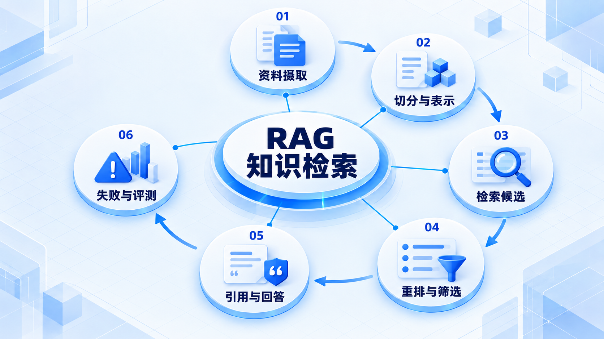
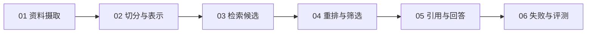

# RAG 知识检索

先把资料整理成可检索内容，再寻找和排序证据；回答必须能回到来源，没有足够证据时要明确限制。

## 学习路线

箭头表示本章概念的推荐学习顺序，不表示实际系统只允许单向运行。框架与方案对照中的选项可以按项目需要选择。

## 本章核心模块

1. **资料摄取**
2. **切分与表示**
3. **检索候选**
4. **重排与筛选**
5. **引用与回答**
6. **失败与评测**

## 按课程顺序阅读

1. [RAG 完整链路：从数据摄取到带引用回答](<../../content/Agent开发/05-Knowledge与Memory/01-Knowledge/01-RAG完整链路.md>) · 文章
2. [Chunk、Embed、Retrieve 与 Rerank 详解](<../../content/Agent开发/05-Knowledge与Memory/01-Knowledge/02-Chunk Embed Retrieve Rerank.md>) · 文章
3. [引用、Grounded Answer 与 RAG 失败处理](<../../content/Agent开发/05-Knowledge与Memory/01-Knowledge/03-引用Grounded Answer与失败处理.md>) · 文章
4. [RAG 推荐阅读](<../../content/Agent开发/05-Knowledge与Memory/01-Knowledge/000-RAG推荐阅读.md>) · 文章

[返回全部章节](README.md)
