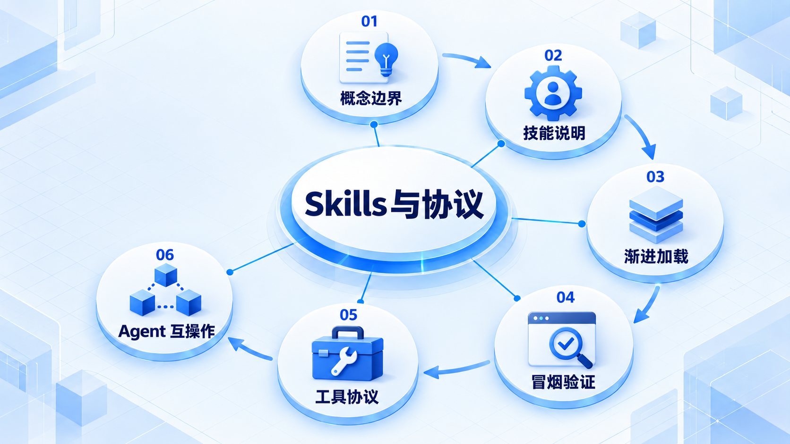
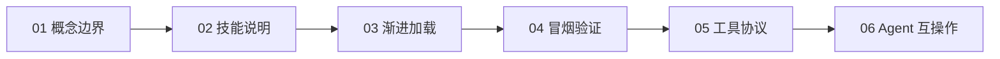

# Skills 与协议

先区分可复用做法、可执行工具和互操作协议，再学习技能加载与验证；MCP、A2A、ACP 处理的边界并不相同。

## 学习路线

箭头表示本章概念的推荐学习顺序，不表示实际系统只允许单向运行。框架与方案对照中的选项可以按项目需要选择。

## 本章核心模块

1. **概念边界**
2. **技能说明**
3. **渐进加载**
4. **冒烟验证**
5. **工具协议**
6. **Agent 互操作**

## 按课程顺序阅读

1. [Skill、Tool、Prompt 与 MCP 的边界](<../../content/Agent开发/07-Skills与Protocols/01-Skill Tool Prompt与MCP边界.md>) · 文章
2. [SKILL.md 设计、渐进加载与 Smoke Test](<../../content/Agent开发/07-Skills与Protocols/02-SKILL设计渐进加载与Smoke Test.md>) · 文章
3. [MCP、A2A 与 ACP：三个不同互操作边界](<../../content/Agent开发/07-Skills与Protocols/03-MCP A2A与ACP.md>) · 文章
4. [Skills 与协议推荐阅读](<../../content/Agent开发/07-Skills与Protocols/000-Skills与协议推荐阅读.md>) · 文章

[返回全部章节](README.md)
