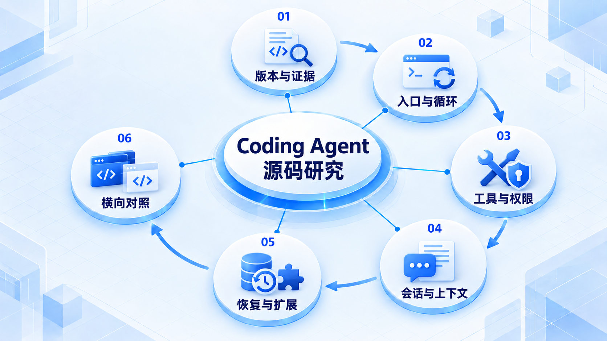
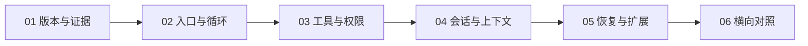

# Coding Agent 源码研究

先确认公开证据和版本范围，再跟踪循环、工具、会话及上下文；把已证实实现和推断分开记录。

## 学习路线

箭头表示本章概念的推荐学习顺序，不表示实际系统只允许单向运行。框架与方案对照中的选项可以按项目需要选择。

## 本章核心模块

1. **版本与证据**
2. **入口与循环**
3. **工具与权限**
4. **会话与上下文**
5. **恢复与扩展**
6. **横向对照**

## 按课程顺序阅读

1. [Coding Agent 源码研究模板与证据等级](<../../content/Agent开发/99-现代Agent架构与源码研究/00-统一研究模板与证据等级.md>) · 文章
2. [OpenAI Codex 源码精读：Agent Loop、工具、Skills、上下文与 Harness](<../../content/Agent开发/99-现代Agent架构与源码研究/AGENT_SOURCE_01_CODEX.md>) · 文章
3. [Anthropic Claude Code 精读：公开仓库、官方运行契约与 Agent Harness](<../../content/Agent开发/99-现代Agent架构与源码研究/AGENT_SOURCE_02_CLAUDE_CODE.md>) · 文章
4. [NousResearch Hermes Agent 源码精读：长运行、自改进 Agent Harness](<../../content/Agent开发/99-现代Agent架构与源码研究/AGENT_SOURCE_04_HERMES_AGENT.md>) · 文章
5. [OpenClaw 源码精读：Gateway、Agent Harness、Tools、Memory 与 Context Engine](<../../content/Agent开发/99-现代Agent架构与源码研究/AGENT_SOURCE_05_OPENCLAW.md>) · 文章
6. [Aider 源码研究：Repo Map、Edit Format 与 Git-aware 修复循环](<../../content/Agent开发/99-现代Agent架构与源码研究/AGENT_SOURCE_07_AIDER.md>) · 文章
7. [Goose 源码研究：Rust State Machine、MCP Extensions 与安全检查链](<../../content/Agent开发/99-现代Agent架构与源码研究/AGENT_SOURCE_08_GOOSE.md>) · 文章
8. [OpenCode 源码研究：Effect Runtime、Server/Client 与 Snapshot-aware Session Loop](<../../content/Agent开发/99-现代Agent架构与源码研究/AGENT_SOURCE_09_OPENCODE.md>) · 文章
9. [DeepSeek Harness Web 源码研究：Cordis 插件树、事件日志与双端运行时](<../../content/Agent开发/99-现代Agent架构与源码研究/AGENT_SOURCE_10_DEEPSEEK_HARNESS_WEB.md>) · 文章
10. [pi-agent 源码研究：极小 Loop、可组合 Harness 与树形 Session](<../../content/Agent开发/99-现代Agent架构与源码研究/AGENT_SOURCE_11_PI_AGENT.md>) · 文章
11. [Grok Build 源码研究：Rust Agent Runtime、并行工具与 Worktree Subagent](<../../content/Agent开发/99-现代Agent架构与源码研究/AGENT_SOURCE_12_GROK_BUILD.md>) · 文章
12. [现代 Agent 架构与实现细节对比：十个 Coding Agent / Harness](<../../content/Agent开发/99-现代Agent架构与源码研究/AGENT_SOURCE_06_COMPARISON.md>) · 文章
13. [现代主流 Coding Agent 研究阅读顺序](<../../content/Agent开发/99-现代Agent架构与源码研究/000-Coding Agent研究阅读顺序.md>) · 文章

[返回全部章节](README.md)
