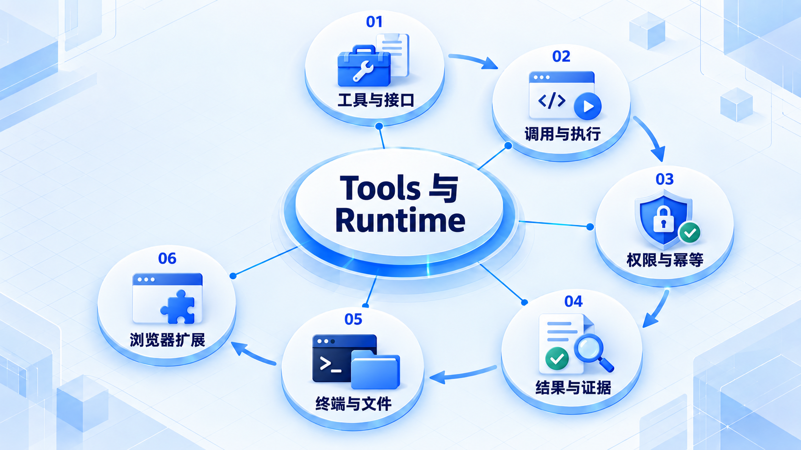

# Tools 与 Runtime

先区分工具声明、调用请求和实际执行，再检查权限、结果与失败；终端、文件和浏览器各有运行边界。

## 学习路线

箭头表示本章概念的推荐学习顺序，不表示实际系统只允许单向运行。框架与方案对照中的选项可以按项目需要选择。

## 本章核心模块

1. **工具与接口**
2. **调用与执行**
3. **权限与幂等**
4. **结果与证据**
5. **终端与文件**
6. **浏览器扩展**

## 按课程顺序阅读

1. [Tool、Invocation、Execution 与 Runtime 边界](<../../content/Agent开发/04-Tools与Runtime/00-Tool与Runtime边界.md>) · 文章
2. [Tools Call：从工具暴露到结果回填](<../../content/Agent开发/04-Tools与Runtime/01-工具调用完整链路.md>) · 文章
3. [工具 Schema、权限门与幂等设计](<../../content/Agent开发/04-Tools与Runtime/02-工具Schema权限与幂等.md>) · 文章
4. [工具失败、空结果、重复调用与证据管理](<../../content/Agent开发/04-Tools与Runtime/03-工具失败空结果与证据.md>) · 文章
5. [Terminal 执行：从命令请求到可验证的进程结果](<../../content/Agent开发/04-Tools与Runtime/04-Terminal执行与进程生命周期.md>) · 文章
6. [Terminal 输出读取：stdout、stderr、事件流与有界观察](<../../content/Agent开发/04-Tools与Runtime/05-Terminal输出流读取与结果归一化.md>) · 文章
7. [File I/O：读取、写入、补丁、并发保护与证据](<../../content/Agent开发/04-Tools与Runtime/06-File IO读取写入补丁与原子更新.md>) · 文章
8. [Browser Runtime](<agent-browser.md>) · 章节
9. [Tools Call 推荐阅读](<../../content/Agent开发/04-Tools与Runtime/000-Tools Call推荐阅读.md>) · 文章

[返回全部章节](README.md)
