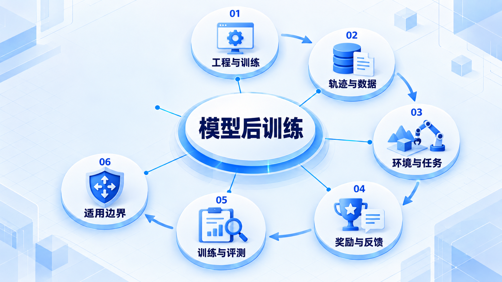
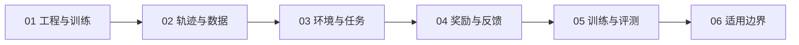

# 模型后训练

先区分应用工程改进与模型参数训练，再认识轨迹、环境和奖励；这是可选高级方向，需要独立评测和数据治理。

## 学习路线

箭头表示本章概念的推荐学习顺序，不表示实际系统只允许单向运行。框架与方案对照中的选项可以按项目需要选择。

## 本章核心模块

1. **工程与训练**
2. **轨迹与数据**
3. **环境与任务**
4. **奖励与反馈**
5. **训练与评测**
6. **适用边界**

## 按课程顺序阅读

1. [Model Post-training：Agent 工程的可选高级轨道](<../../content/Agent开发/11-Model Post-training/01-Model Post-training导学.md>) · 文章
2. [Trajectory、Reward、Environment 与 Agentic RL](<../../content/Agent开发/11-Model Post-training/02-Trajectory Reward与Agentic RL.md>) · 文章

[返回全部章节](README.md)
