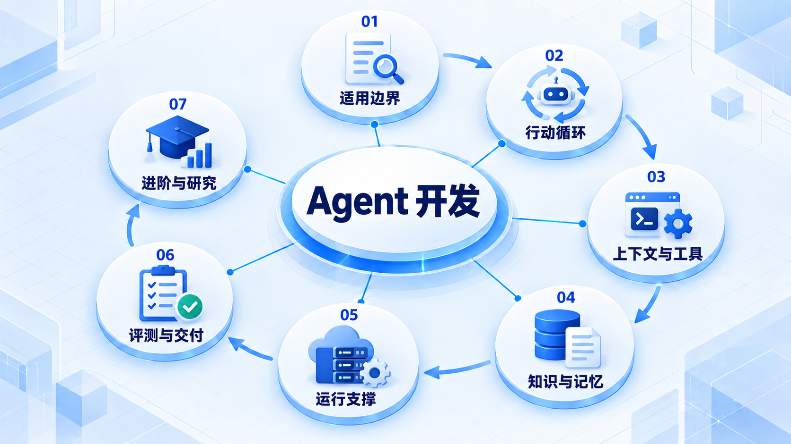
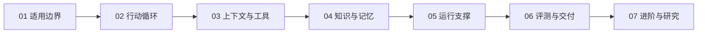

# Agent 开发

先构建能观察、行动和停止的最小 Agent，再补齐上下文、工具、检索与运行支撑；评测和生产交付之后再按需进入高级方向。

## 学习路线

箭头表示本章概念的推荐学习顺序，不表示实际系统只允许单向运行。框架与方案对照中的选项可以按项目需要选择。

## 本章核心模块

1. **适用边界**
2. **行动循环**
3. **上下文与工具**
4. **知识与记忆**
5. **运行支撑**
6. **评测与交付**
7. **进阶与研究**

## 按课程顺序阅读

1. [Agent 开发学习路线：从 Minimum Agent 到 Production Agent](<../../content/Agent开发/00-Agent开发学习路线.md>) · 文章
2. [Agent 基础](<agent-basics.md>) · 章节
3. [Agent Loop](<agent-loop.md>) · 章节
4. [Context Engineering](<agent-context.md>) · 章节
5. [Tools 与 Runtime](<agent-tools.md>) · 章节
6. [知识与记忆](<agent-knowledge-memory.md>) · 章节
7. [Agent Harness](<agent-harness.md>) · 章节
8. [Skills 与协议](<agent-skills.md>) · 章节
9. [评测、观测与安全](<agent-evaluation.md>) · 章节
10. [Production Agent](<agent-production.md>) · 章节
11. [Agent 项目阶梯](<agent-projects.md>) · 章节
12. [完整 Agent 链路](<agent-endtoend.md>) · 章节
13. [多 Agent 协作](<agent-multi.md>) · 章节
14. [Agent 受控改进](<agent-evolution.md>) · 章节
15. [模型后训练](<agent-training.md>) · 章节
16. [Coding Agent 源码研究](<agent-source.md>) · 章节

[返回全部章节](README.md)
