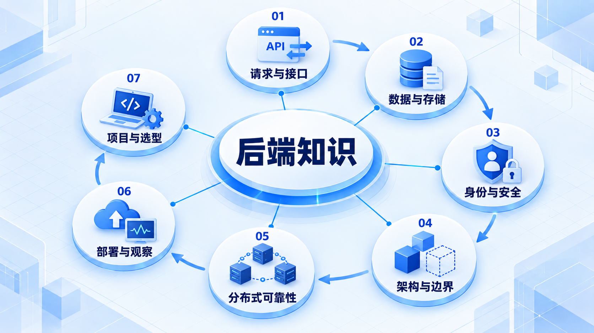
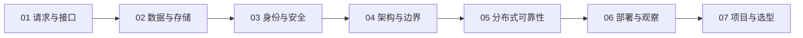

# 后端知识

跟随一次请求进入服务，先掌握数据和权限，再比较架构；分布式方案应由实际问题驱动。

## 学习路线

箭头表示本章概念的推荐学习顺序，不表示实际系统只允许单向运行。框架与方案对照中的选项可以按项目需要选择。

## 本章核心模块

1. **请求与接口**
2. **数据与存储**
3. **身份与安全**
4. **架构与边界**
5. **分布式可靠性**
6. **部署与观察**
7. **项目与选型**

## 按课程顺序阅读

1. [后端知识学习路线：从一次请求到一个可靠的服务](<../../content/后端知识/00-后端知识学习路线.md>) · 文章
2. [请求与接口基础](<be-request.md>) · 章节
3. [数据与存储](<be-data.md>) · 章节
4. [身份、权限与安全](<be-security.md>) · 章节
5. [常见后端架构](<be-architecture.md>) · 章节
6. [分布式与可靠性](<be-reliability.md>) · 章节
7. [部署与可观测性](<be-operations.md>) · 章节
8. [后端项目实战与选型](<be-practice.md>) · 章节
9. [后端学习推荐阅读：先找问题，再查原文](<../../content/后端知识/000-后端学习推荐阅读.md>) · 文章

[返回全部章节](README.md)
