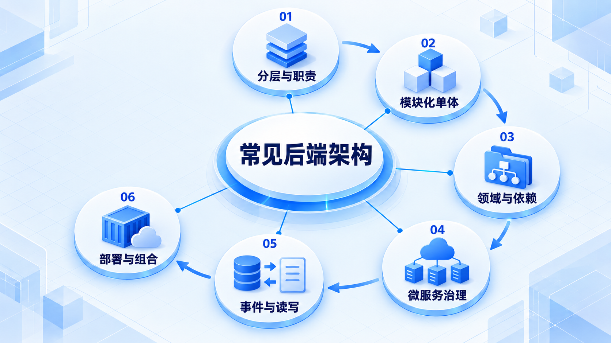
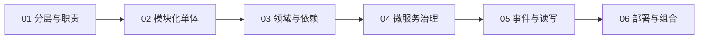

# 常见后端架构

先建立职责边界，再比较不同架构解决的问题和额外成本；这些方案不是必须逐级升级的一条产品路线。

## 学习路线

箭头表示本章概念的推荐学习顺序，不表示实际系统只允许单向运行。框架与方案对照中的选项可以按项目需要选择。

## 本章核心模块

1. **分层与职责**
2. **模块化单体**
3. **领域与依赖**
4. **微服务治理**
5. **事件与读写**
6. **部署与组合**

## 按课程顺序阅读

1. [分层架构与 MVC：把请求处理和业务规则分开](<../../content/后端知识/02-常见后端架构/01-分层架构MVC与调用边界.md>) · 文章
2. [模块化单体：先把边界分清，再决定是否拆服务](<../../content/后端知识/02-常见后端架构/02-模块化单体与领域边界.md>) · 文章
3. [六边形架构、Clean Architecture 与 DDD：相近但不同的三个问题](<../../content/后端知识/02-常见后端架构/03-六边形Clean与DDD入门.md>) · 文章
4. [微服务、SOA 与服务治理：拆开以后要多承担什么](<../../content/后端知识/02-常见后端架构/04-微服务SOA与服务治理.md>) · 文章
5. [事件驱动、CQRS 与 Event Sourcing：别把三个概念混成一套](<../../content/后端知识/02-常见后端架构/05-事件驱动CQRS与EventSourcing.md>) · 文章
6. [Serverless、BFF 与 Web-Queue-Worker：按不同轴线组合架构](<../../content/后端知识/02-常见后端架构/06-ServerlessBFF与WebQueueWorker.md>) · 文章

[返回全部章节](README.md)
