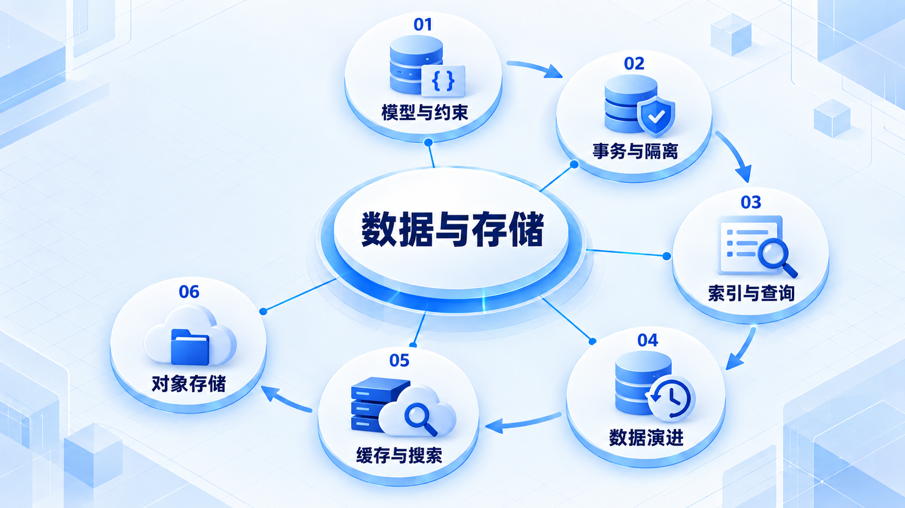
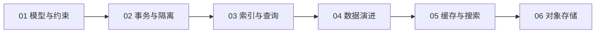

# 数据与存储

先用模型、约束和事务守住正确性，再根据访问方式理解索引与演进；缓存、搜索和对象存储各有职责。

## 学习路线

箭头表示本章概念的推荐学习顺序，不表示实际系统只允许单向运行。框架与方案对照中的选项可以按项目需要选择。

## 本章核心模块

1. **模型与约束**
2. **事务与隔离**
3. **索引与查询**
4. **数据演进**
5. **缓存与搜索**
6. **对象存储**

## 按课程顺序阅读

1. [关系模型、约束与事务：让错误状态存不进去](<../../content/后端知识/03-数据与存储/01-关系模型约束与事务隔离.md>) · 文章
2. [索引、查询计划与数据演进：先看访问方式，再设计表](<../../content/后端知识/03-数据与存储/02-索引查询计划与数据演进.md>) · 文章
3. [缓存、搜索与对象存储：每种存储各负责什么](<../../content/后端知识/03-数据与存储/03-缓存搜索对象存储与一致性.md>) · 文章

[返回全部章节](README.md)
