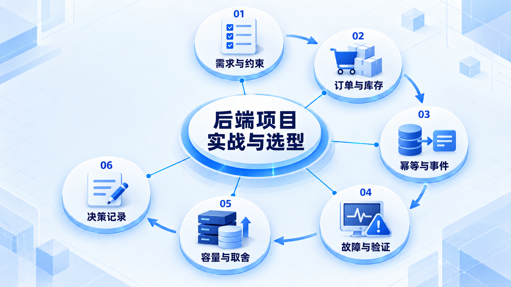
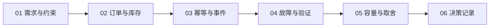

# 后端项目实战与选型

用订单、库存和可靠事件串起后端知识，再根据约束估算容量、记录取舍，并检查失败路径。

## 学习路线

箭头表示本章概念的推荐学习顺序，不表示实际系统只允许单向运行。框架与方案对照中的选项可以按项目需要选择。

## 本章核心模块

1. **需求与约束**
2. **订单与库存**
3. **幂等与事件**
4. **故障与验证**
5. **容量与取舍**
6. **决策记录**

## 按课程顺序阅读

1. [订单服务实战：用库存、幂等和 Outbox 串起后端知识](<../../content/后端知识/07-项目实战与选型/01-订单服务从零到可靠交付.md>) · 文章
2. [架构选型、容量估算与 ADR：把选择写成可验证的判断](<../../content/后端知识/07-项目实战与选型/02-架构选型容量估算与ADR.md>) · 文章

[返回全部章节](README.md)
