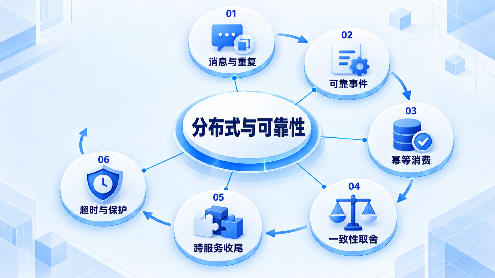

# 分布式与可靠性

先承认消息可能重复、依赖可能失败，再设计可靠事件、跨服务收尾和过载保护，不把重试当成万能解法。

## 学习路线

箭头表示本章概念的推荐学习顺序，不表示实际系统只允许单向运行。框架与方案对照中的选项可以按项目需要选择。

## 本章核心模块

1. **消息与重复**
2. **可靠事件**
3. **幂等消费**
4. **一致性取舍**
5. **跨服务收尾**
6. **超时与保护**

## 按课程顺序阅读

1. [消息队列、Outbox 与幂等消费：接受重复，避免丢失意图](<../../content/后端知识/04-分布式与可靠性/01-消息队列Outbox与幂等消费.md>) · 文章
2. [一致性、CAP 与 Saga：跨服务流程怎样收尾](<../../content/后端知识/04-分布式与可靠性/02-一致性CAP与Saga状态机.md>) · 文章
3. [超时、重试、限流与熔断：依赖变慢时别把自己拖垮](<../../content/后端知识/04-分布式与可靠性/03-超时重试限流熔断与隔离.md>) · 文章

[返回全部章节](README.md)
