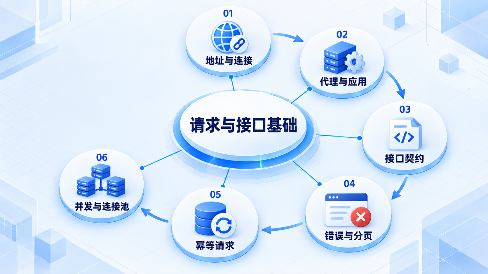
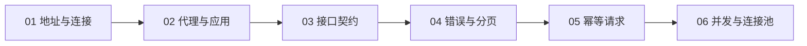

# 请求与接口基础

先追踪一次请求的来回，再约定接口的输入、结果和错误；最后理解服务如何同时处理多个请求。

## 学习路线

箭头表示本章概念的推荐学习顺序，不表示实际系统只允许单向运行。框架与方案对照中的选项可以按项目需要选择。

## 本章核心模块

1. **地址与连接**
2. **代理与应用**
3. **接口契约**
4. **错误与分页**
5. **幂等请求**
6. **并发与连接池**

## 按课程顺序阅读

1. [一次请求的完整旅程：DNS、TLS、代理与应用](<../../content/后端知识/01-请求与接口基础/01-一次请求的完整旅程.md>) · 文章
2. [API 契约：资源、错误、分页与幂等](<../../content/后端知识/01-请求与接口基础/02-API契约错误分页与幂等.md>) · 文章
3. [进程、线程、异步和连接池：服务怎样同时处理请求](<../../content/后端知识/01-请求与接口基础/03-进程线程异步与连接池.md>) · 文章

[返回全部章节](README.md)
