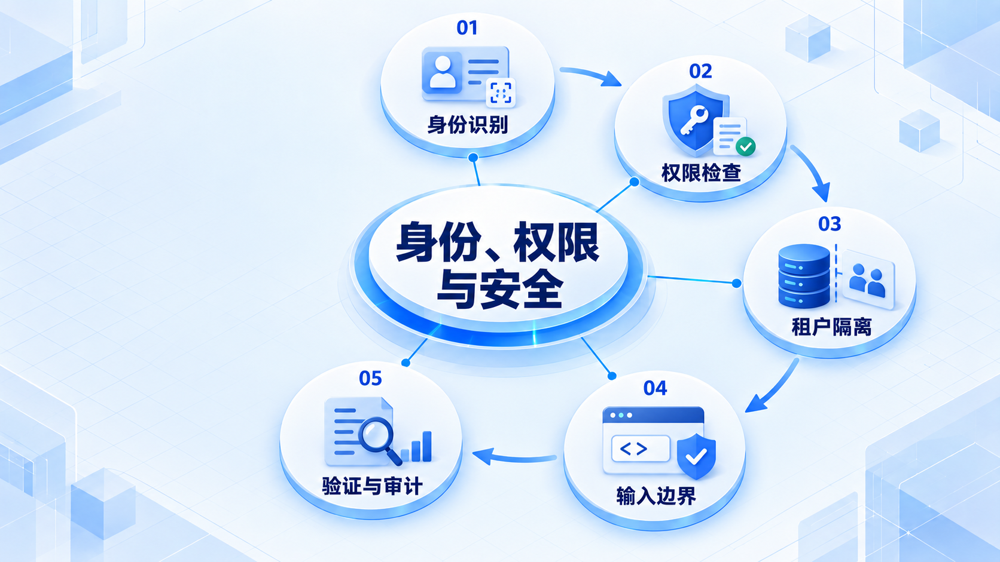
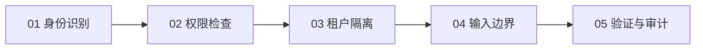

# 身份、权限与安全

先区分“你是谁”和“你能做什么”，再检查租户隔离和输入边界；登录成功不代表可以访问任意数据。

## 学习路线

箭头表示本章概念的推荐学习顺序，不表示实际系统只允许单向运行。框架与方案对照中的选项可以按项目需要选择。

## 本章核心模块

1. **身份识别**
2. **权限检查**
3. **租户隔离**
4. **输入边界**
5. **验证与审计**

## 按课程顺序阅读

1. [认证、授权与多租户：登录成功只是第一步](<../../content/后端知识/05-身份权限与安全/01-认证授权多租户与输入边界.md>) · 文章

[返回全部章节](README.md)
