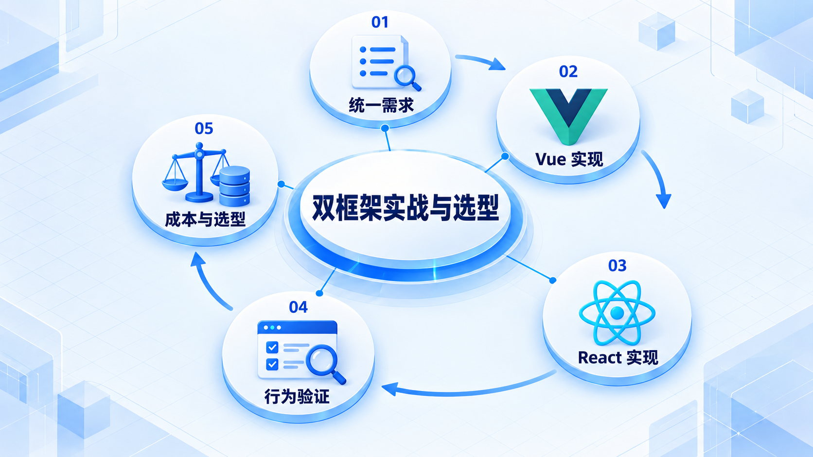

# 双框架实战与选型

用同一个文章搜索需求分别实践 Vue 和 React，比较交互、数据流与维护成本，再给出有依据的选择。

## 学习路线

箭头表示本章概念的推荐学习顺序，不表示实际系统只允许单向运行。框架与方案对照中的选项可以按项目需要选择。

## 本章核心模块

1. **统一需求**
2. **Vue 实现**
3. **React 实现**
4. **行为验证**
5. **成本与选型**

## 按课程顺序阅读

1. [双框架实战：用 Vue 和 React 做同一个文章搜索器](<../../content/前端架构/07-双框架实战与选型/01-双框架文章搜索实战.md>) · 文章
2. [Vue 与 React 怎么选：先看团队和产品，再看语法偏好](<../../content/前端架构/07-双框架实战与选型/02-Vue与React对照和选型.md>) · 文章

[返回全部章节](README.md)
