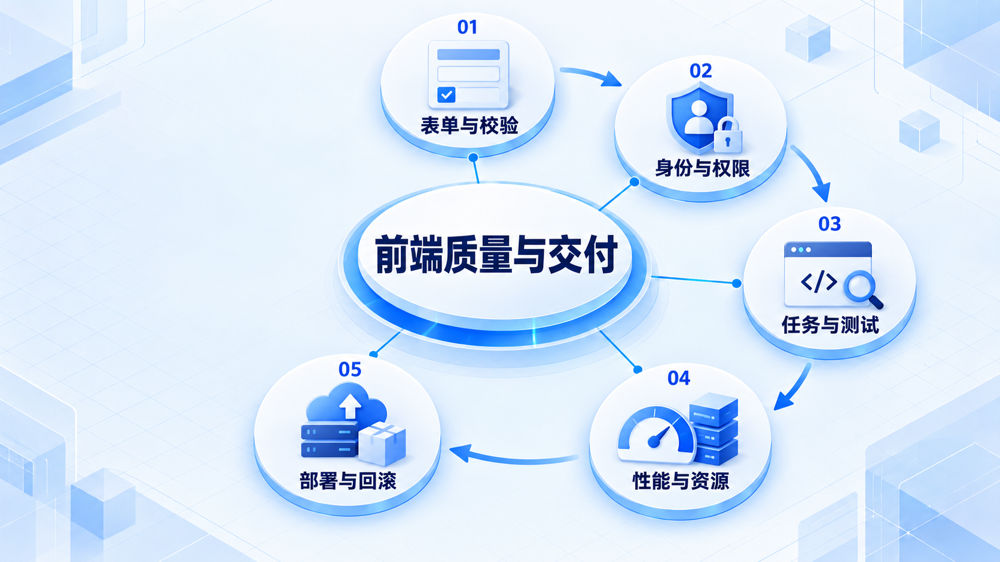

# 前端质量与交付

先保证用户能正确完成操作，再检查权限边界、回归测试和性能；构建成功后仍要验证真实部署。

## 学习路线

箭头表示本章概念的推荐学习顺序，不表示实际系统只允许单向运行。框架与方案对照中的选项可以按项目需要选择。

## 本章核心模块

1. **表单与校验**
2. **身份与权限**
3. **任务与测试**
4. **性能与资源**
5. **部署与回滚**

## 按课程顺序阅读

1. [表单、身份与安全：隐藏按钮不是权限控制](<../../content/前端架构/06-质量安全与交付/01-表单身份与前端安全.md>) · 文章
2. [前端测试：证明用户能完成任务，而不是证明函数被调用](<../../content/前端架构/06-质量安全与交付/02-测试策略与故障演练.md>) · 文章
3. [前端性能：先找到慢在哪里，再决定怎么优化](<../../content/前端架构/06-质量安全与交付/03-性能指标与资源加载.md>) · 文章
4. [Vercel 部署与回滚：构建成功之后还要确认什么](<../../content/前端架构/06-质量安全与交付/04-Vercel部署配置与回滚.md>) · 文章

[返回全部章节](README.md)
