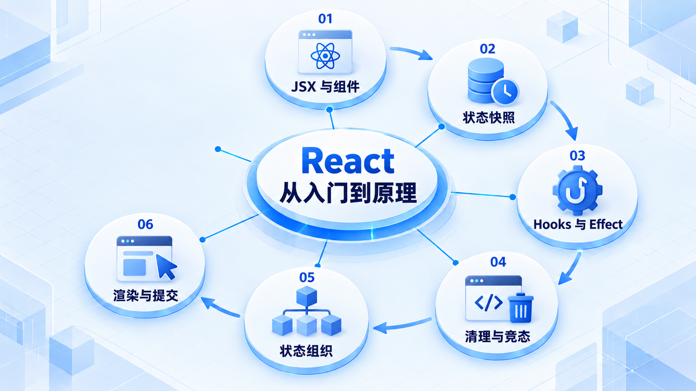
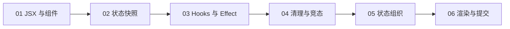

# React 从入门到原理

先理解 JSX、组件和状态快照，再处理外部同步与复杂状态；最后区分渲染、提交和浏览器绘制。

## 学习路线

箭头表示本章概念的推荐学习顺序，不表示实际系统只允许单向运行。框架与方案对照中的选项可以按项目需要选择。

## 本章核心模块

1. **JSX 与组件**
2. **状态快照**
3. **Hooks 与 Effect**
4. **清理与竞态**
5. **状态组织**
6. **渲染与提交**

## 按课程顺序阅读

1. [React 入门：JSX、组件和状态快照](<../../content/前端架构/04-React从入门到原理/01-JSX组件与状态快照.md>) · 文章
2. [React Hooks 与 Effect：把外部系统同步好](<../../content/前端架构/04-React从入门到原理/02-Hooks-Effect与请求竞态.md>) · 文章
3. [Reducer、Context 与自定义 Hook：把复杂交互写清楚](<../../content/前端架构/04-React从入门到原理/03-Reducer-Context与自定义Hook.md>) · 文章
4. [React 渲染、提交与性能：重渲染不等于重画整页](<../../content/前端架构/04-React从入门到原理/04-渲染提交协调与性能.md>) · 文章

[返回全部章节](README.md)
