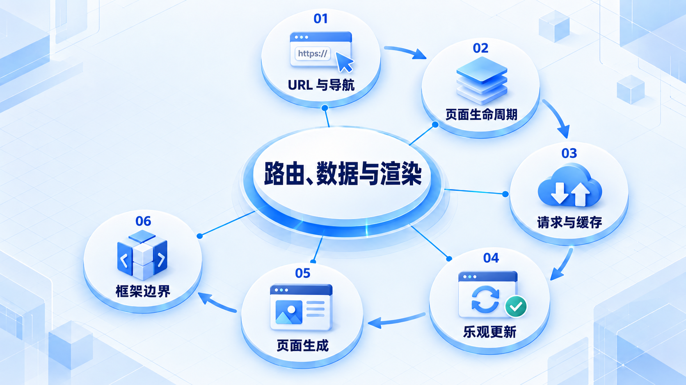

# 路由、数据与渲染

从 URL 和返回行为开始，再理解请求缓存和页面生成位置；框架提供组织方式，业务边界仍需要自己决定。

## 学习路线

箭头表示本章概念的推荐学习顺序，不表示实际系统只允许单向运行。框架与方案对照中的选项可以按项目需要选择。

## 本章核心模块

1. **URL 与导航**
2. **页面生命周期**
3. **请求与缓存**
4. **乐观更新**
5. **页面生成**
6. **框架边界**

## 按课程顺序阅读

1. [路由与 URL：让刷新、分享和返回都有道理](<../../content/前端架构/05-路由数据与渲染/01-路由URL与页面生命周期.md>) · 文章
2. [服务端状态、缓存与乐观更新：页面里的数据什么时候算数](<../../content/前端架构/05-路由数据与渲染/02-服务端状态缓存与乐观更新.md>) · 文章
3. [CSR、SSR、SSG 与 Hydration：页面在哪里生成](<../../content/前端架构/05-路由数据与渲染/03-CSR-SSR-SSG与Hydration.md>) · 文章
4. [Nuxt 与 Next.js：框架替你组织什么，什么仍要自己决定](<../../content/前端架构/05-路由数据与渲染/04-Nuxt与Next全栈边界.md>) · 文章

[返回全部章节](README.md)
