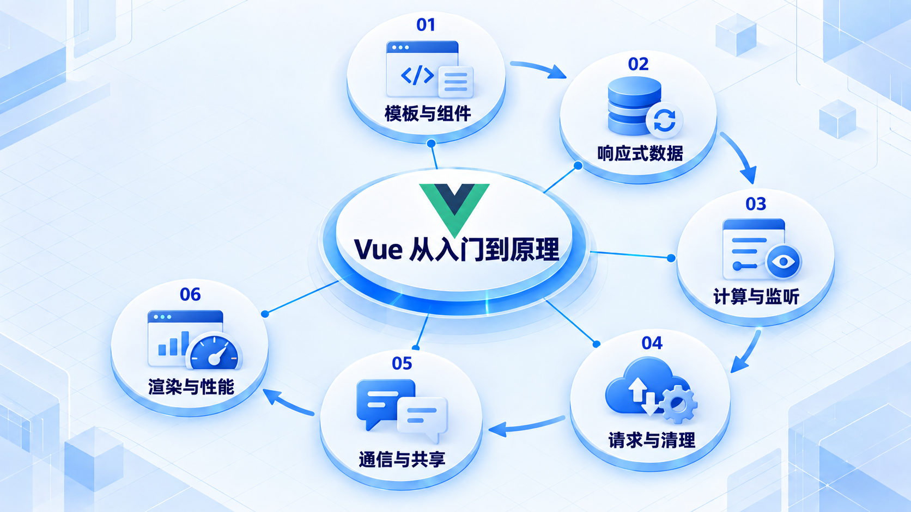
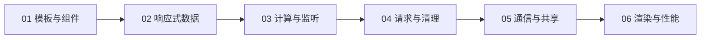

# Vue 从入门到原理

从文章筛选组件开始，先弄懂数据怎样驱动界面，再处理副作用、共享状态与渲染性能。

## 学习路线

箭头表示本章概念的推荐学习顺序，不表示实际系统只允许单向运行。框架与方案对照中的选项可以按项目需要选择。

## 本章核心模块

1. **模板与组件**
2. **响应式数据**
3. **计算与监听**
4. **请求与清理**
5. **通信与共享**
6. **渲染与性能**

## 按课程顺序阅读

1. [Vue 入门：从一个能筛选文章的组件开始](<../../content/前端架构/03-Vue从入门到原理/01-模板组件与响应式入门.md>) · 文章
2. [computed、watch 与清理：别让旧请求覆盖新结果](<../../content/前端架构/03-Vue从入门到原理/02-computed-watch与副作用清理.md>) · 文章
3. [Vue 组件通信、Composables 与 Pinia：共享到哪一层才合适](<../../content/前端架构/03-Vue从入门到原理/03-组件通信Composables与Pinia.md>) · 文章
4. [Vue 的渲染机制：数据改了以后发生什么](<../../content/前端架构/03-Vue从入门到原理/04-Vue渲染机制与性能边界.md>) · 文章

[返回全部章节](README.md)
