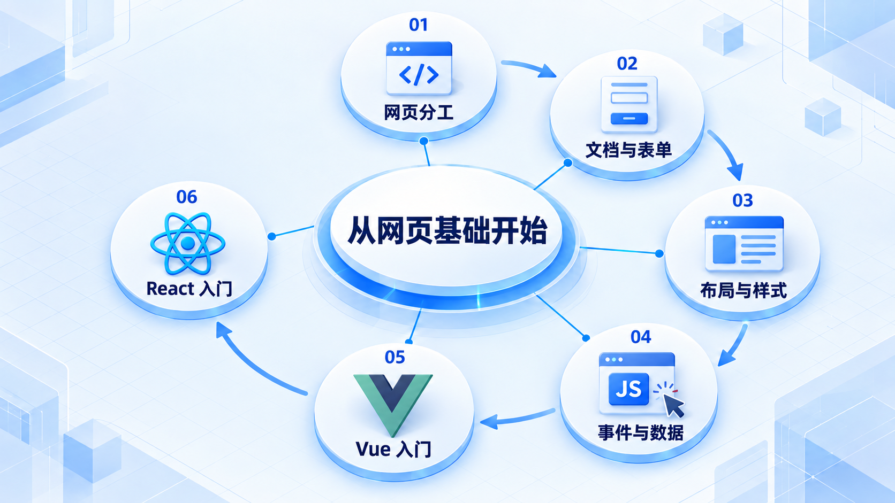
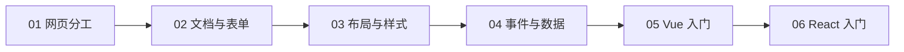

# 从网页基础开始

先用 HTML、CSS 和 JavaScript 做出可交互页面，再认识 Vue 与 React 如何组织界面；两个框架可以先选一个学习。

## 学习路线

箭头表示本章概念的推荐学习顺序，不表示实际系统只允许单向运行。框架与方案对照中的选项可以按项目需要选择。

## 本章核心模块

1. **网页分工**
2. **文档与表单**
3. **布局与样式**
4. **事件与数据**
5. **Vue 入门**
6. **React 入门**

## 按课程顺序阅读

1. [HTML、CSS、JavaScript、Vue、React 到底是什么：先把关系讲清楚](<../../content/前端架构/00-从网页基础开始/01-HTML-CSS-JavaScript-Vue-React到底是什么.md>) · 文章
2. [HTML 从文档结构到表单：亲手写出第一张网页](<../../content/前端架构/00-从网页基础开始/02-HTML从文档结构到表单.md>) · 文章
3. [CSS 从选择器到响应式布局：让页面真正适合阅读](<../../content/前端架构/00-从网页基础开始/03-CSS从选择器到响应式布局.md>) · 文章
4. [JavaScript、事件、数据与 DOM：亲手做出文章搜索](<../../content/前端架构/00-从网页基础开始/04-JavaScript事件数据与DOM.md>) · 文章
5. [Vue 从安装到第一个完整页面：把数据和界面接起来](<../../content/前端架构/00-从网页基础开始/05-Vue从安装到第一个完整页面.md>) · 文章
6. [React 从安装到第一个完整页面：理解组件、JSX 和状态](<../../content/前端架构/00-从网页基础开始/06-React从安装到第一个完整页面.md>) · 文章

[返回全部章节](README.md)
