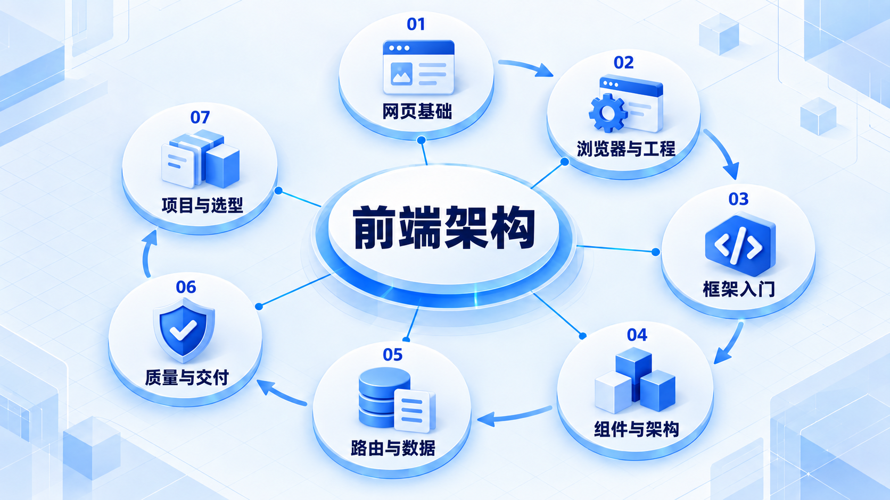
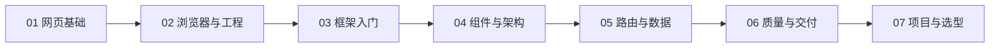

# 前端架构

先做能使用的网页，再理解框架、组件边界和数据流；Vue 与 React 可以先选一条实践，再进行对照。

## 学习路线

箭头表示本章概念的推荐学习顺序，不表示实际系统只允许单向运行。框架与方案对照中的选项可以按项目需要选择。

## 本章核心模块

1. **网页基础**
2. **浏览器与工程**
3. **框架入门**
4. **组件与架构**
5. **路由与数据**
6. **质量与交付**
7. **项目与选型**

## 按课程顺序阅读

1. [前端架构学习路线：从一个页面到一个能维护的产品](<../../content/前端架构/00-前端架构学习路线.md>) · 文章
2. [从网页基础开始](<fe-web.md>) · 章节
3. [浏览器与工程基础](<fe-browser.md>) · 章节
4. [Vue 从入门到原理](<fe-vue.md>) · 章节
5. [React 从入门到原理](<fe-react.md>) · 章节
6. [组件与架构设计](<fe-components.md>) · 章节
7. [路由、数据与渲染](<fe-routing.md>) · 章节
8. [前端质量与交付](<fe-quality.md>) · 章节
9. [双框架实战与选型](<fe-practice.md>) · 章节
10. [前端学习推荐阅读：带着问题读开源教程](<../../content/前端架构/000-前端学习推荐阅读.md>) · 文章

[返回全部章节](README.md)
