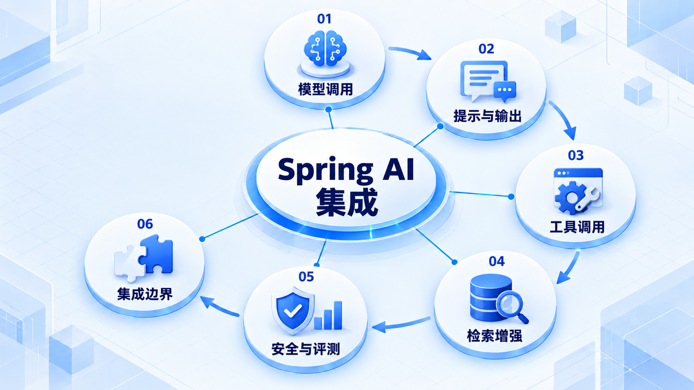
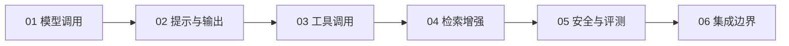

# Spring AI 集成

先接通模型调用，再组织提示、结构化结果和工具；检索增强、安全与评测需要在业务中分别验证。

## 学习路线

箭头表示本章概念的推荐学习顺序，不表示实际系统只允许单向运行。框架与方案对照中的选项可以按项目需要选择。

## 本章核心模块

1. **模型调用**
2. **提示与输出**
3. **工具调用**
4. **检索增强**
5. **安全与评测**
6. **集成边界**

## 按课程顺序阅读

1. [Spring AI 工程实现总览（可选）](<../../content/Java开发/16-可选专项/04-Spring AI/01-Spring AI工程实现总览.md>) · 文章

[返回全部章节](README.md)
