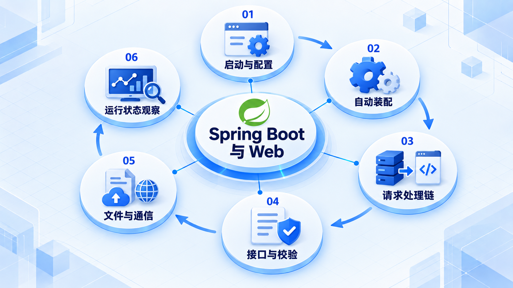

# Spring Boot 与 Web

先启动并配置服务，再跟踪请求经过容器与控制器的路径，最后完善接口契约和运行状态观察。

## 学习路线

箭头表示本章概念的推荐学习顺序，不表示实际系统只允许单向运行。框架与方案对照中的选项可以按项目需要选择。

## 本章核心模块

1. **启动与配置**
2. **自动装配**
3. **请求处理链**
4. **接口与校验**
5. **文件与通信**
6. **运行状态观察**

## 按课程顺序阅读

1. [Spring Boot 与 Web：从零开始的阶段导学](<../../content/Java开发/06-Spring Boot与Web/00-本阶段导学.md>) · 文章
2. [Spring Boot 自动配置、Starter、配置文件与启动过程](<../../content/Java开发/06-Spring Boot与Web/01-Spring-Boot自动配置与启动.md>) · 文章
3. [Servlet、Tomcat 与 Spring MVC 请求完整链路](<../../content/Java开发/06-Spring Boot与Web/02-Servlet-Tomcat-Spring-MVC完整链路.md>) · 文章
4. [REST API：资源建模、HTTP 语义、校验、错误处理与版本演进](<../../content/Java开发/06-Spring Boot与Web/03-REST-API校验错误处理与版本.md>) · 文章
5. [Spring Boot Actuator、日志、指标、追踪与生产配置](<../../content/Java开发/06-Spring Boot与Web/04-Actuator日志指标追踪与生产配置.md>) · 文章
6. [OpenAPI、文件处理、邮件与 WebSocket](<../../content/Java开发/06-Spring Boot与Web/05-OpenAPI文件处理邮件与WebSocket.md>) · 文章
7. [Spring Boot 与 Web 开发推荐阅读](<../../content/Java开发/06-Spring Boot与Web/000-Spring Boot 与 Web 开发推荐阅读.md>) · 文章

[返回全部章节](README.md)
