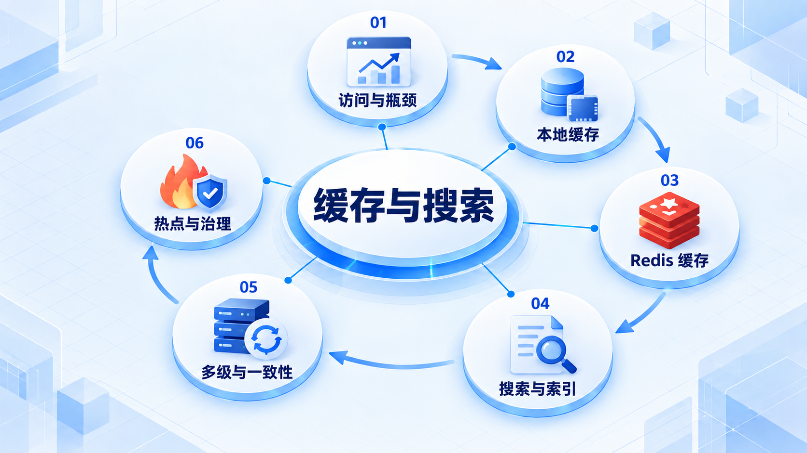

# 缓存与搜索

先用访问模式和性能证据说明需求，再选择缓存或搜索；始终检查失效、一致性和热点问题。

## 学习路线

箭头表示本章概念的推荐学习顺序，不表示实际系统只允许单向运行。框架与方案对照中的选项可以按项目需要选择。

## 本章核心模块

1. **访问与瓶颈**
2. **本地缓存**
3. **Redis 缓存**
4. **搜索与索引**
5. **多级与一致性**
6. **热点与治理**

## 按课程顺序阅读

1. [缓存与搜索：在证据出现后引入](<../../content/Java开发/11-缓存与搜索/00-缓存与搜索导学.md>) · 文章
2. [Redis 与缓存工程：数据类型、持久化、高可用、集群与一致性](<../../content/Java开发/11-缓存与搜索/01-Redis与缓存工程.md>) · 文章
3. [Elasticsearch 搜索工程：Mapping、分析器、Query DSL、分片与聚合](<../../content/Java开发/11-缓存与搜索/02-Elasticsearch搜索工程.md>) · 文章
4. [缓存、CDN、读写分离、分库分表与热点治理](<../../content/Java开发/11-缓存与搜索/03-缓存CDN分库分表与热点治理.md>) · 文章
5. [Caffeine 本地缓存与多级缓存](<../../content/Java开发/11-缓存与搜索/04-Caffeine本地缓存与多级缓存.md>) · 文章

[返回全部章节](README.md)
