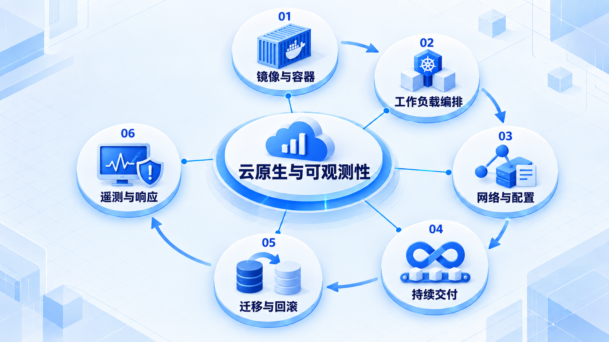

# 云原生与可观测性

先把服务打包成可重复运行的镜像，再学习编排和交付；上线后用遥测、目标与故障响应维持可用性。

## 学习路线

箭头表示本章概念的推荐学习顺序，不表示实际系统只允许单向运行。框架与方案对照中的选项可以按项目需要选择。

## 本章核心模块

1. **镜像与容器**
2. **工作负载编排**
3. **网络与配置**
4. **持续交付**
5. **迁移与回滚**
6. **遥测与响应**

## 按课程顺序阅读

1. [云原生、DevOps 与可观测性：从零开始的阶段导学](<../../content/Java开发/15-云原生DevOps与可观测性/00-本阶段导学.md>) · 文章
2. [Docker：镜像、容器、Compose 与供应链](<../../content/Java开发/15-云原生DevOps与可观测性/01-Docker镜像-Compose与供应链.md>) · 文章
3. [Kubernetes：工作负载、网络、配置、Secret 与探针](<../../content/Java开发/15-云原生DevOps与可观测性/02-Kubernetes工作负载网络配置与探针.md>) · 文章
4. [CI/CD、发布策略、数据库迁移与回滚](<../../content/Java开发/15-云原生DevOps与可观测性/03-CICD发布数据库迁移与回滚.md>) · 文章
5. [OpenTelemetry、SLO、告警与故障响应](<../../content/Java开发/15-云原生DevOps与可观测性/04-OpenTelemetry-SLO与故障响应.md>) · 文章
6. [云原生、DevOps 与可观测性推荐阅读](<../../content/Java开发/15-云原生DevOps与可观测性/000-云原生、DevOps 与可观测性推荐阅读.md>) · 文章

[返回全部章节](README.md)
