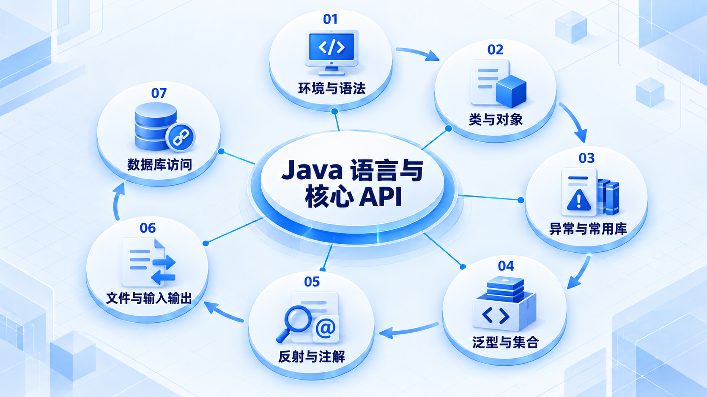
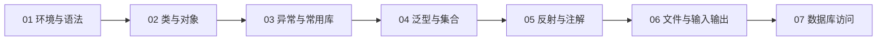

# Java 语言与核心 API

从编译运行、变量和方法开始，逐步建立对象与异常模型；学会泛型后再组织集合，并连接文件与数据库。

## 学习路线

箭头表示本章概念的推荐学习顺序，不表示实际系统只允许单向运行。框架与方案对照中的选项可以按项目需要选择。

## 本章核心模块

1. **环境与语法**
2. **类与对象**
3. **异常与常用库**
4. **泛型与集合**
5. **反射与注解**
6. **文件与输入输出**
7. **数据库访问**

## 按课程顺序阅读

1. [Java 开发入门：平台、JDK、编译运行与开发环境](<../../content/Java开发/01-Java语言与核心API/01-Java开发入门.md>) · 文章
2. [Java 编程基础：语法、类型、运算、控制流、方法与数组](<../../content/Java开发/01-Java语言与核心API/02-Java编程基础.md>) · 文章
3. [面向对象（上）：类、对象、封装、构造器、this、代码块与 static](<../../content/Java开发/01-Java语言与核心API/03-面向对象上.md>) · 文章
4. [面向对象（下）：继承、super、final、抽象、接口、多态、Object 与内部类](<../../content/Java开发/01-Java语言与核心API/04-面向对象下.md>) · 文章
5. [异常处理：异常体系、try/catch/finally、throw/throws 与自定义异常](<../../content/Java开发/01-Java语言与核心API/05-异常处理.md>) · 文章
6. [Java 核心 API：字符串、系统、数学、时间、包装类与正则表达式](<../../content/Java开发/01-Java语言与核心API/06-Java核心API.md>) · 文章
7. [Java 泛型：泛型类、接口、方法、通配符、边界与类型擦除](<../../content/Java开发/01-Java语言与核心API/08-Java泛型.md>) · 文章
8. [Java 集合框架：Collection、List、Set、Map、遍历、工具类与 Lambda](<../../content/Java开发/01-Java语言与核心API/07-Java集合框架.md>) · 文章
9. [泛型与集合框架综合：类型安全容器、迭代、排序与集合选型](<../../content/Java开发/01-Java语言与核心API/14-泛型与集合框架综合.md>) · 文章
10. [Java 反射机制：Class、构造器、字段、方法、注解与动态代理](<../../content/Java开发/01-Java语言与核心API/09-反射机制.md>) · 文章
11. [Java I/O 与 NIO.2：文件、字节流、字符流、转换流与序列化](<../../content/Java开发/01-Java语言与核心API/10-IO与NIO.md>) · 文章
12. [JDBC 数据库访问：驱动、连接、Statement、事务、批处理与连接池](<../../content/Java开发/01-Java语言与核心API/11-JDBC数据库访问.md>) · 文章
13. [Java 基础推荐阅读](<../../content/Java开发/01-Java语言与核心API/000-Java基础推荐阅读.md>) · 文章

[返回全部章节](README.md)
