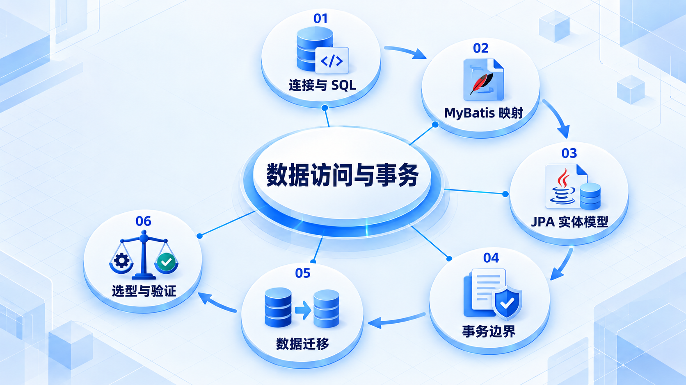

# 数据访问与事务

先理解连接和 SQL 执行，再比较映射与实体模型；事务边界、迁移和技术选择必须围绕实际业务。

## 学习路线

箭头表示本章概念的推荐学习顺序，不表示实际系统只允许单向运行。框架与方案对照中的选项可以按项目需要选择。

## 本章核心模块

1. **连接与 SQL**
2. **MyBatis 映射**
3. **JPA 实体模型**
4. **事务边界**
5. **数据迁移**
6. **选型与验证**

## 按课程顺序阅读

1. [数据访问与 ORM：从零开始的阶段导学](<../../content/Java开发/07-数据访问与事务/00-本阶段导学.md>) · 文章
2. [MyBatis：映射、动态 SQL、插件与工程边界](<../../content/Java开发/07-数据访问与事务/01-MyBatis映射与动态SQL.md>) · 文章
3. [JPA、Hibernate 与 Spring Data：实体状态、映射和查询](<../../content/Java开发/07-数据访问与事务/02-JPA-Hibernate与Spring-Data.md>) · 文章
4. [连接池、事务、数据库迁移与数据访问技术决策](<../../content/Java开发/07-数据访问与事务/03-连接池事务迁移与数据访问决策.md>) · 文章
5. [MyBatis-Plus 工程实践](<../../content/Java开发/07-数据访问与事务/04-MyBatis-Plus工程实践.md>) · 文章
6. [JDBC vs MyBatis vs JPA：按问题选择数据访问方式](<../../content/Java开发/07-数据访问与事务/05-JDBC vs MyBatis vs JPA决策.md>) · 文章
7. [数据访问与 ORM推荐阅读](<../../content/Java开发/07-数据访问与事务/000-数据访问与 ORM推荐阅读.md>) · 文章

[返回全部章节](README.md)
