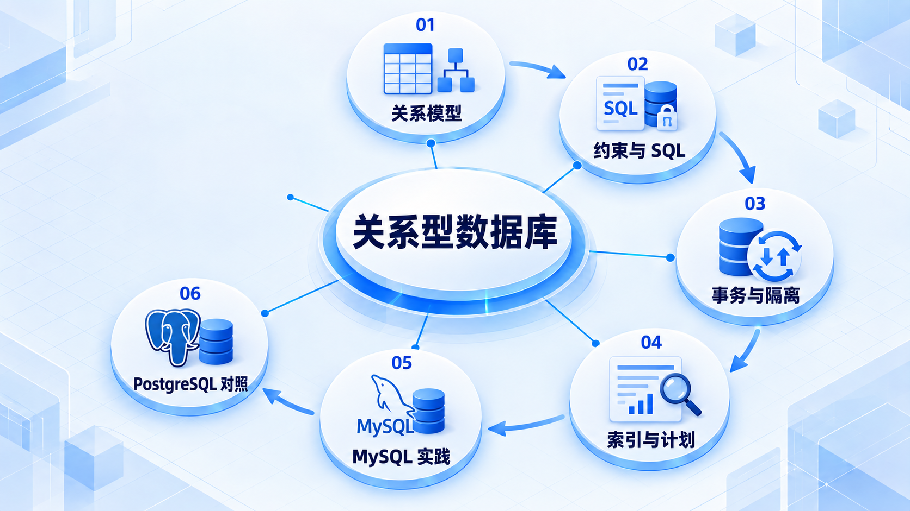

# 关系型数据库

先建立表、约束、查询与事务模型，再比较 MySQL 和 PostgreSQL；根据执行计划判断优化方向。

## 学习路线

箭头表示本章概念的推荐学习顺序，不表示实际系统只允许单向运行。框架与方案对照中的选项可以按项目需要选择。

## 本章核心模块

1. **关系模型**
2. **约束与 SQL**
3. **事务与隔离**
4. **索引与计划**
5. **MySQL 实践**
6. **PostgreSQL 对照**

## 按课程顺序阅读

1. [数据库、缓存与搜索：从零开始的阶段导学](<../../content/Java开发/04-关系型数据库/00-本阶段导学.md>) · 文章
2. [数据库原理与 SQL：模型、约束、查询、事务与执行计划](<../../content/Java开发/04-关系型数据库/01-数据库原理与SQL.md>) · 文章
3. [MySQL：InnoDB、索引、事务、MVCC、日志与性能调优](<../../content/Java开发/04-关系型数据库/02-MySQL-InnoDB索引事务与调优.md>) · 文章
4. [PostgreSQL 基础：类型、索引、MVCC、执行计划与选型](<../../content/Java开发/04-关系型数据库/03-PostgreSQL基础.md>) · 文章
5. [数据库、缓存与搜索推荐阅读](<../../content/Java开发/04-关系型数据库/000-数据库、缓存与搜索推荐阅读.md>) · 文章

[返回全部章节](README.md)
