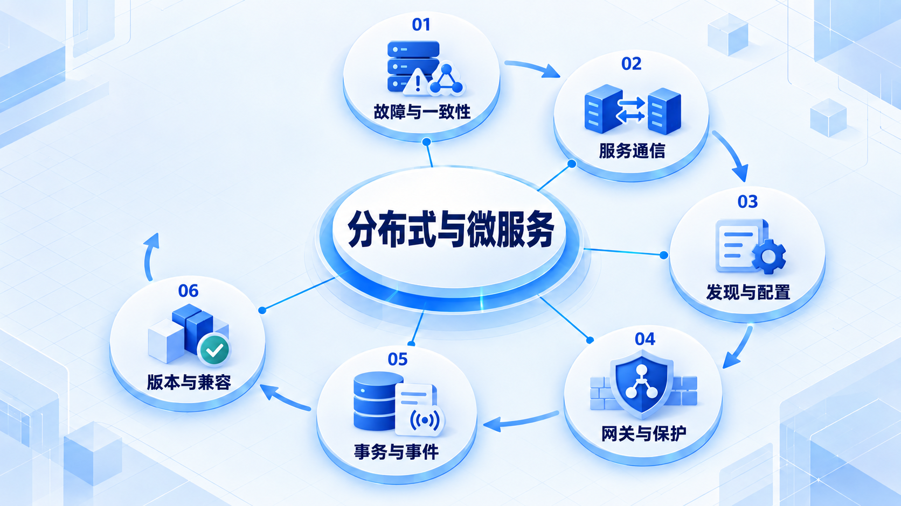

# 分布式与微服务

先理解部分失败和一致性取舍，再处理通信、发现、保护与跨服务流程；组件组合须核对兼容关系。

## 学习路线

箭头表示本章概念的推荐学习顺序，不表示实际系统只允许单向运行。框架与方案对照中的选项可以按项目需要选择。

## 本章核心模块

1. **故障与一致性**
2. **服务通信**
3. **发现与配置**
4. **网关与保护**
5. **事务与事件**
6. **版本与兼容**

## 按课程顺序阅读

1. [分布式系统与微服务：从零开始的阶段导学](<../../content/Java开发/13-分布式与微服务/00-本阶段导学.md>) · 文章
2. [分布式基础：故障模型、CAP、BASE、复制与共识](<../../content/Java开发/13-分布式与微服务/01-分布式基础CAP-BASE与共识.md>) · 文章
3. [服务通信：HTTP、OpenFeign、Dubbo、gRPC 与 Netty](<../../content/Java开发/13-分布式与微服务/02-RPC-HTTP-OpenFeign-Dubbo-gRPC与Netty.md>) · 文章
4. [Nacos：服务注册、发现、健康检查与配置治理](<../../content/Java开发/13-分布式与微服务/03-Nacos注册发现与配置治理.md>) · 文章
5. [API 网关、负载均衡、限流、熔断、降级与重试](<../../content/Java开发/13-分布式与微服务/04-网关负载均衡限流熔断与重试.md>) · 文章
6. [分布式 ID、分布式事务、Outbox、Saga 与可靠事件](<../../content/Java开发/13-分布式与微服务/05-分布式ID事务与可靠事件.md>) · 文章
7. [Spring Cloud 与 Spring Cloud Alibaba 组件图](<../../content/Java开发/13-分布式与微服务/06-Spring-Cloud与Spring-Cloud-Alibaba组件图.md>) · 文章
8. [Seata、Sentinel 与 SkyWalking 实战边界](<../../content/Java开发/13-分布式与微服务/07-Seata-Sentinel-SkyWalking实战边界.md>) · 文章
9. [Spring Cloud Compatibility Matrix 与升级检查](<../../content/Java开发/13-分布式与微服务/08-Spring Cloud Compatibility Matrix与升级.md>) · 文章
10. [分布式系统与微服务推荐阅读](<../../content/Java开发/13-分布式与微服务/000-分布式系统与微服务推荐阅读.md>) · 文章

[返回全部章节](README.md)
