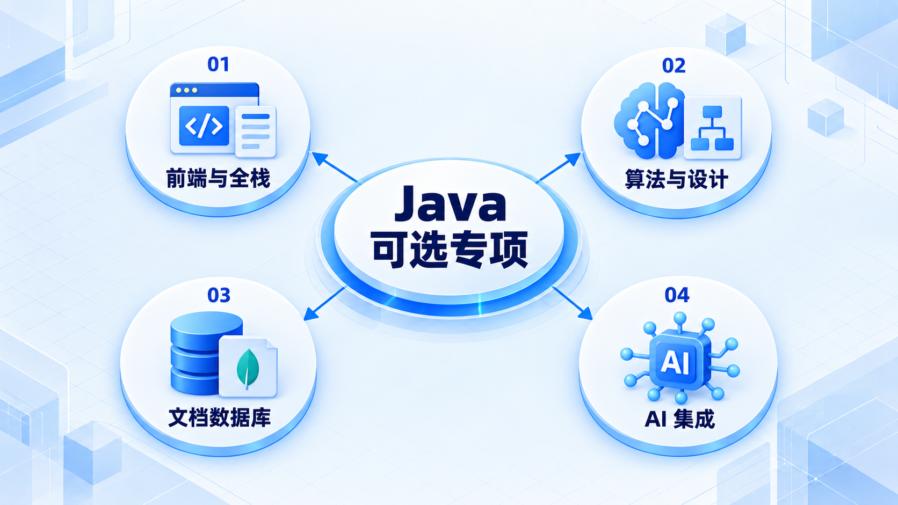
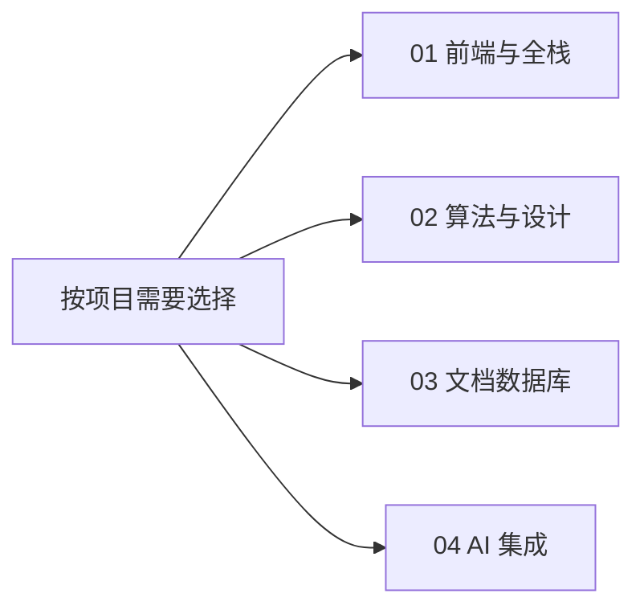

# Java 可选专项

先完成 Java 后端主线，再按项目需要选择专项；下面四条是并列选择，不要求按顺序全部学习。

## 学习路线

各分支是按需选择的方向，不表示必须依次完成。

## 本章核心模块

1. **前端与全栈**
2. **算法与设计**
3. **文档数据库**
4. **AI 集成**

## 按课程顺序阅读

1. [前端与全栈交付](<java-fullstack.md>) · 章节
2. [算法与工程设计](<java-cs.md>) · 章节
3. [MongoDB 数据模型](<java-mongodb.md>) · 章节
4. [Spring AI 集成](<java-ai.md>) · 章节

[返回全部章节](README.md)
