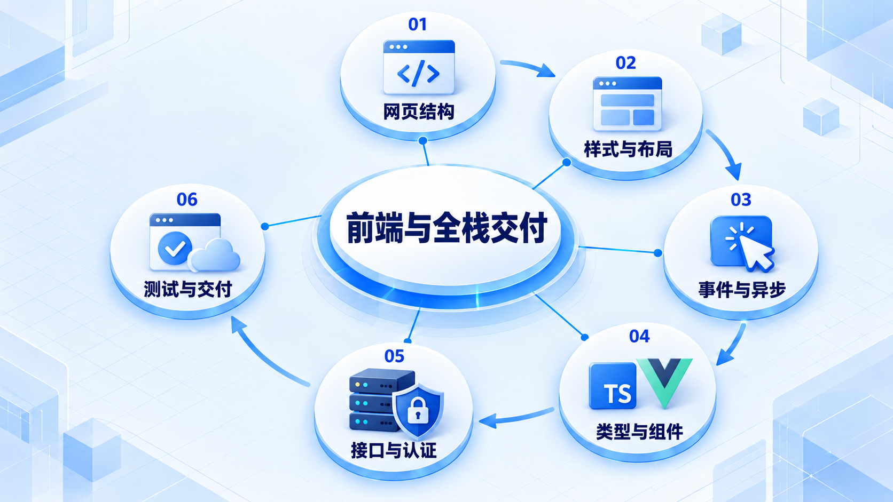

# 前端与全栈交付

从网页结构、样式和交互开始，再使用 TypeScript 与 Vue 组织界面，最后与后端契约和部署环境连通。

## 学习路线

箭头表示本章概念的推荐学习顺序，不表示实际系统只允许单向运行。框架与方案对照中的选项可以按项目需要选择。

## 本章核心模块

1. **网页结构**
2. **样式与布局**
3. **事件与异步**
4. **类型与组件**
5. **接口与认证**
6. **测试与交付**

## 按课程顺序阅读

1. [前端基础与全栈交付：从零开始的阶段导学](<../../content/Java开发/16-可选专项/01-前端与全栈交付/00-本阶段导学.md>) · 文章
2. [Web、HTML、CSS、JavaScript 与 TypeScript 基础](<../../content/Java开发/16-可选专项/01-前端与全栈交付/01-Web-HTML-CSS-JavaScript与TypeScript基础.md>) · 文章
3. [HTML：语义结构、表单、媒体与可访问性](<../../content/Java开发/16-可选专项/01-前端与全栈交付/04-HTML语义表单媒体与可访问性.md>) · 文章
4. [CSS：级联、盒模型、布局、响应式与动画](<../../content/Java开发/16-可选专项/01-前端与全栈交付/05-CSS级联盒模型布局响应式与动画.md>) · 文章
5. [JavaScript 基础：类型、函数、集合、DOM 与事件](<../../content/Java开发/16-可选专项/01-前端与全栈交付/06-JavaScript基础类型函数集合DOM与事件.md>) · 文章
6. [JavaScript 高级：异步、模块、网络与性能](<../../content/Java开发/16-可选专项/01-前端与全栈交付/07-JavaScript高级异步模块网络与性能.md>) · 文章
7. [Vue 3、TypeScript 与后台管理界面](<../../content/Java开发/16-可选专项/01-前端与全栈交付/02-Vue3-TypeScript与后台管理界面.md>) · 文章
8. [TypeScript、Vue 工程化、测试与性能](<../../content/Java开发/16-可选专项/01-前端与全栈交付/08-TypeScript-Vue工程化测试与性能.md>) · 文章
9. [全栈交付：契约、认证、上传下载、WebSocket 与 Nginx](<../../content/Java开发/16-可选专项/01-前端与全栈交付/03-全栈契约认证上传下载WebSocket与Nginx.md>) · 文章
10. [前端基础与全栈交付推荐阅读](<../../content/Java开发/16-可选专项/01-前端与全栈交付/000-前端基础与全栈交付推荐阅读.md>) · 文章

[返回全部章节](README.md)
