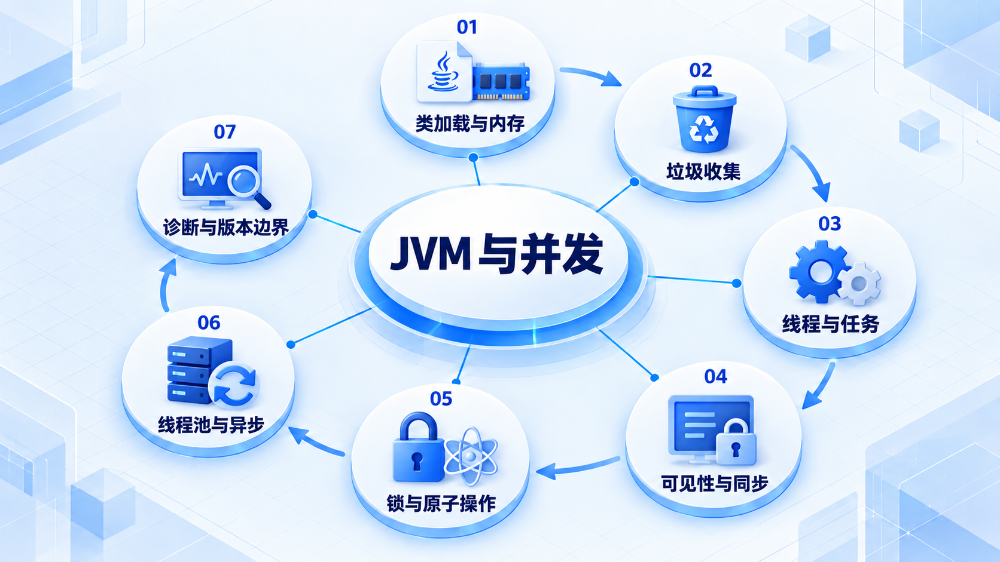

# JVM 与并发

先理解代码怎样运行和使用内存，再处理线程协作与可见性；高级并发能力要结合项目使用的 JDK 版本。

## 学习路线

箭头表示本章概念的推荐学习顺序，不表示实际系统只允许单向运行。框架与方案对照中的选项可以按项目需要选择。

## 本章核心模块

1. **类加载与内存**
2. **垃圾收集**
3. **线程与任务**
4. **可见性与同步**
5. **锁与原子操作**
6. **线程池与异步**
7. **诊断与版本边界**

## 按课程顺序阅读

1. [JVM 与并发：从运行时到生产诊断](<../../content/Java开发/02-JVM与并发/00-JVM与并发学习导图.md>) · 文章
2. [JVM 内存、类加载、字节码与垃圾收集](<../../content/Java开发/02-JVM与并发/01-JVM内存类加载字节码与GC.md>) · 文章
3. [Java 并发与多线程：生命周期、同步、锁、线程池、虚拟线程与取消](<../../content/Java开发/02-JVM与并发/02-Java并发与多线程.md>) · 文章
4. [JMM、线程池、锁、原子类与 CompletableFuture](<../../content/Java开发/02-JVM与并发/03-JMM线程池锁原子类与CompletableFuture.md>) · 文章
5. [Virtual Threads、Scoped Values 与 Structured Concurrency](<../../content/Java开发/02-JVM与并发/04-Virtual Threads Scoped Values与Structured Concurrency.md>) · 文章

[返回全部章节](README.md)
