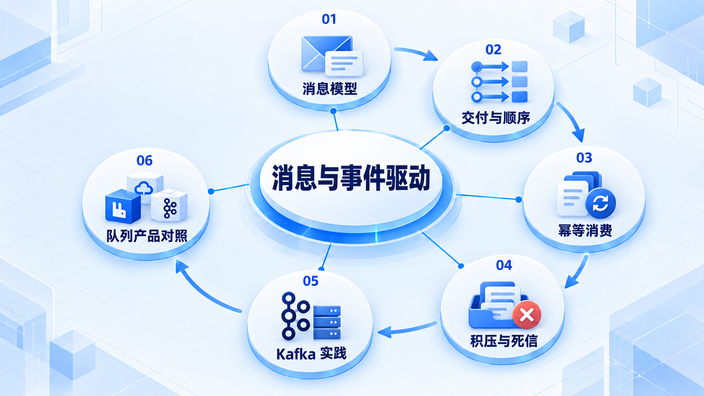
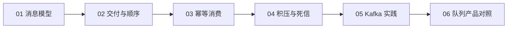

# 消息与事件驱动

先理解消息交付、顺序和重复，再比较产品；可靠消费与积压治理比只记配置更重要。

## 学习路线

箭头表示本章概念的推荐学习顺序，不表示实际系统只允许单向运行。框架与方案对照中的选项可以按项目需要选择。

## 本章核心模块

1. **消息模型**
2. **交付与顺序**
3. **幂等消费**
4. **积压与死信**
5. **Kafka 实践**
6. **队列产品对照**

## 按课程顺序阅读

1. [消息与事件驱动：共同模型先于产品配置](<../../content/Java开发/12-消息与事件驱动/00-本阶段导学.md>) · 文章
2. [消息队列基础：交付、顺序、幂等、积压与死信](<../../content/Java开发/12-消息与事件驱动/02-消息队列基础与可靠消费.md>) · 文章
3. [Apache Kafka：日志、分区、副本、消费组与事务](<../../content/Java开发/12-消息与事件驱动/03-Kafka事件流平台.md>) · 文章
4. [RabbitMQ 与 RocketMQ：路由、队列、可靠性和选择](<../../content/Java开发/12-消息与事件驱动/04-RabbitMQ与RocketMQ.md>) · 文章
5. [高性能与消息队列推荐阅读](<../../content/Java开发/12-消息与事件驱动/000-高性能与消息队列推荐阅读.md>) · 文章

[返回全部章节](README.md)
