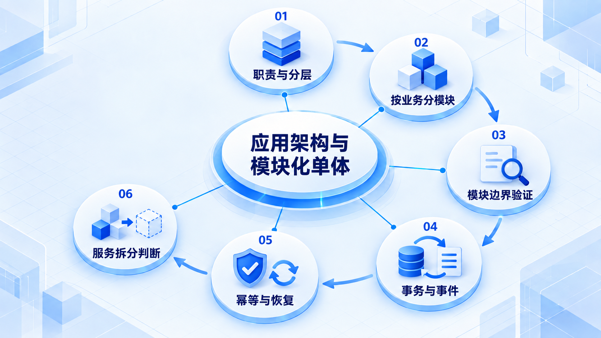

# 应用架构与模块化单体

先在一个应用中把模块边界守住，再处理事务与事件；只有证据表明需要独立服务时，才讨论拆分。

## 学习路线

箭头表示本章概念的推荐学习顺序，不表示实际系统只允许单向运行。框架与方案对照中的选项可以按项目需要选择。

## 本章核心模块

1. **职责与分层**
2. **按业务分模块**
3. **模块边界验证**
4. **事务与事件**
5. **幂等与恢复**
6. **服务拆分判断**

## 按课程顺序阅读

1. [应用架构与模块化单体：先学会维护一个单体](<../../content/Java开发/10-应用架构与模块化单体/00-应用架构导学.md>) · 文章
2. [Layered、Package by Feature 与领域边界](<../../content/Java开发/10-应用架构与模块化单体/01-分层按功能打包与领域边界.md>) · 文章
3. [Spring Modulith：模块验证、集成测试、事件与可观测性](<../../content/Java开发/10-应用架构与模块化单体/02-Spring Modulith模块验证测试事件与可观测性.md>) · 文章
4. [Transaction Boundary、Outbox 与 Idempotency](<../../content/Java开发/10-应用架构与模块化单体/03-事务边界Outbox与幂等.md>) · 文章
5. [模块化单体到微服务：什么时候应该拆？](<../../content/Java开发/10-应用架构与模块化单体/04-模块化单体到微服务什么时候拆.md>) · 文章

[返回全部章节](README.md)
