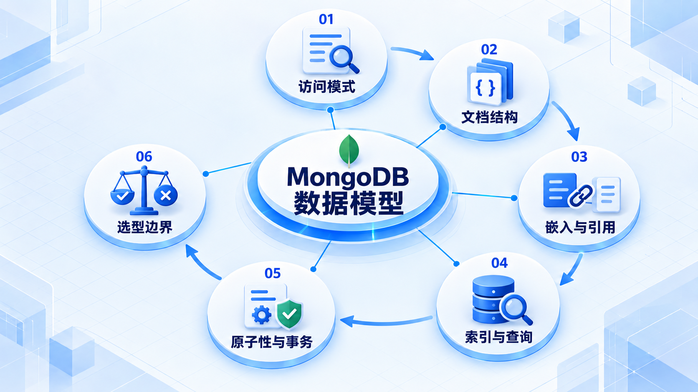
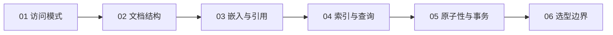

# MongoDB 数据模型

先分析读取和更新方式，再选择嵌入或引用；检查索引、原子性与事务需求，最后判断是否适合当前业务。

## 学习路线

箭头表示本章概念的推荐学习顺序，不表示实际系统只允许单向运行。框架与方案对照中的选项可以按项目需要选择。

## 本章核心模块

1. **访问模式**
2. **文档结构**
3. **嵌入与引用**
4. **索引与查询**
5. **原子性与事务**
6. **选型边界**

## 按课程顺序阅读

1. [MongoDB 文档模型与选型（可选）](<../../content/Java开发/16-可选专项/03-MongoDB数据模型/01-MongoDB文档模型与选型.md>) · 文章

[返回全部章节](README.md)
