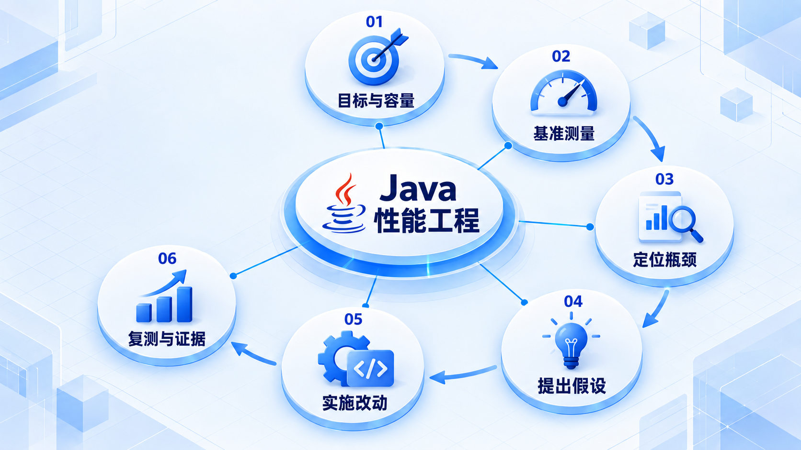

# Java 性能工程

先明确目标并测量，再定位瓶颈和提出假设；每次只做可解释的改动，随后重新测量确认结果。

## 学习路线

箭头表示本章概念的推荐学习顺序，不表示实际系统只允许单向运行。框架与方案对照中的选项可以按项目需要选择。

## 本章核心模块

1. **目标与容量**
2. **基准测量**
3. **定位瓶颈**
4. **提出假设**
5. **实施改动**
6. **复测与证据**

## 按课程顺序阅读

1. [性能工程：Measure → Locate → Hypothesis → Change → Re-measure](<../../content/Java开发/14-性能工程/00-性能工程导学.md>) · 文章
2. [性能工程：容量、基准、剖析与 JVM 诊断](<../../content/Java开发/14-性能工程/01-性能工程容量规划与JVM诊断.md>) · 文章

[返回全部章节](README.md)
