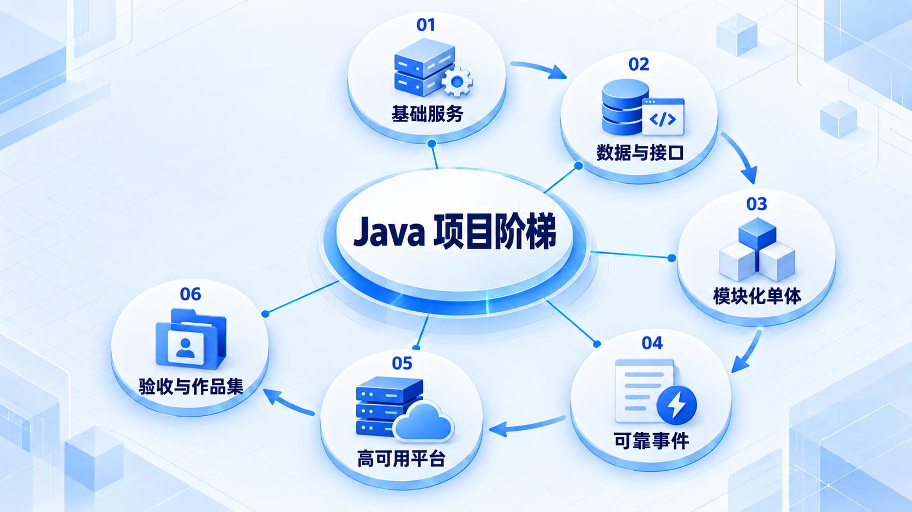

# Java 项目阶梯

从能运行的小服务逐步增加数据、测试和架构要求；任务系统、订单系统和高可用平台是递进练习，不要求一步到位。

## 学习路线

箭头表示本章概念的推荐学习顺序，不表示实际系统只允许单向运行。框架与方案对照中的选项可以按项目需要选择。

## 本章核心模块

1. **基础服务**
2. **数据与接口**
3. **模块化单体**
4. **可靠事件**
5. **高可用平台**
6. **验收与作品集**

## 按课程顺序阅读

1. [Java 后端项目阶梯：从零开始的阶段导学](<../../content/Java开发/17-项目阶梯/00-本阶段导学.md>) · 文章
2. [P0–P8 Java 后端项目阶梯](<../../content/Java开发/17-项目阶梯/01-P0到P8 Java后端项目阶梯.md>) · 文章
3. [项目一：模块化单体任务系统](<../../content/Java开发/17-项目阶梯/01-项目一模块化单体任务系统.md>) · 文章
4. [项目二：事件驱动订单、库存与支付系统](<../../content/Java开发/17-项目阶梯/02-项目二事件驱动订单与库存系统.md>) · 文章
5. [项目三：云原生高可用服务平台](<../../content/Java开发/17-项目阶梯/03-项目三云原生高可用平台.md>) · 文章
6. [作品集验收、文档与面试证据](<../../content/Java开发/17-项目阶梯/04-作品集验收与面试证据.md>) · 文章
7. [Java 后端项目阶梯推荐阅读](<../../content/Java开发/17-项目阶梯/000-Java 后端项目阶梯推荐阅读.md>) · 文章

[返回全部章节](README.md)
