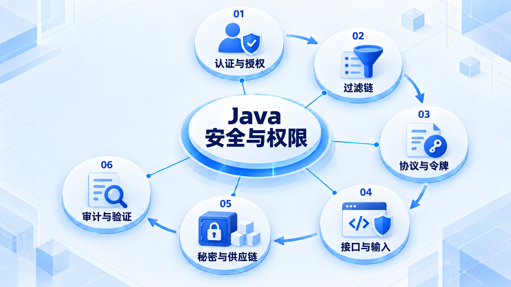
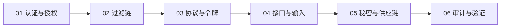

# Java 安全与权限

先理解认证、授权与过滤链，再学习协议和令牌；输入、秘密、依赖和审计都属于安全边界。

## 学习路线

箭头表示本章概念的推荐学习顺序，不表示实际系统只允许单向运行。框架与方案对照中的选项可以按项目需要选择。

## 本章核心模块

1. **认证与授权**
2. **过滤链**
3. **协议与令牌**
4. **接口与输入**
5. **秘密与供应链**
6. **审计与验证**

## 按课程顺序阅读

1. [安全、认证与授权：从零开始的阶段导学](<../../content/Java开发/09-安全认证与授权/00-本阶段导学.md>) · 文章
2. [Spring Security：过滤链、认证、授权与方法安全](<../../content/Java开发/09-安全认证与授权/01-Spring-Security过滤链与方法授权.md>) · 文章
3. [OAuth 2.0、OIDC、JWT 与 API 安全](<../../content/Java开发/09-安全认证与授权/02-OAuth2-OIDC-JWT与API安全.md>) · 文章
4. [Java 应用安全：输入、秘密、供应链、文件与审计](<../../content/Java开发/09-安全认证与授权/03-应用安全秘密供应链与审计.md>) · 文章
5. [安全、认证与授权推荐阅读](<../../content/Java开发/09-安全认证与授权/000-安全、认证与授权推荐阅读.md>) · 文章

[返回全部章节](README.md)
