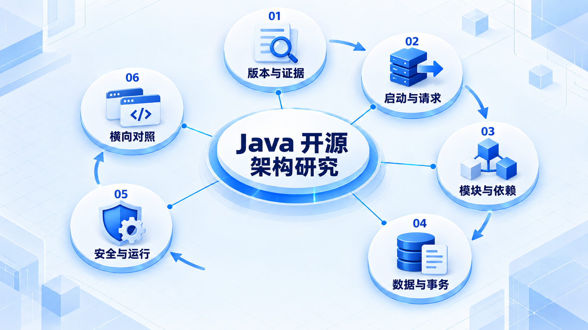

# Java 开源架构研究

带着固定问题进入源码，先确认版本和证据，再追踪请求、数据与模块边界；不同项目用同一框架比较。

## 学习路线

箭头表示本章概念的推荐学习顺序，不表示实际系统只允许单向运行。框架与方案对照中的选项可以按项目需要选择。

## 本章核心模块

1. **版本与证据**
2. **启动与请求**
3. **模块与依赖**
4. **数据与事务**
5. **安全与运行**
6. **横向对照**

## 按课程顺序阅读

1. [Java 开源项目统一源码研究模板](<../../content/Java开发/99-开源项目架构研究/00-统一源码研究模板.md>) · 文章
2. [Spring Petclinic 架构研究入口](<../../content/Java开发/99-开源项目架构研究/01-Spring Petclinic.md>) · 文章
3. [Spring Modulith 架构研究入口](<../../content/Java开发/99-开源项目架构研究/02-Spring Modulith.md>) · 文章
4. [Spring Petclinic Microservices 架构研究入口](<../../content/Java开发/99-开源项目架构研究/03-Petclinic Microservices.md>) · 文章
5. [Keycloak 架构研究入口](<../../content/Java开发/99-开源项目架构研究/04-Keycloak.md>) · 文章
6. [JHipster Generator 架构研究入口](<../../content/Java开发/99-开源项目架构研究/05-JHipster Generator.md>) · 文章
7. [RuoYi-Vue-Plus 架构研究入口](<../../content/Java开发/99-开源项目架构研究/06-RuoYi-Vue-Plus.md>) · 文章
8. [Spring AI 架构研究入口](<../../content/Java开发/99-开源项目架构研究/07-Spring AI.md>) · 文章

[返回全部章节](README.md)
