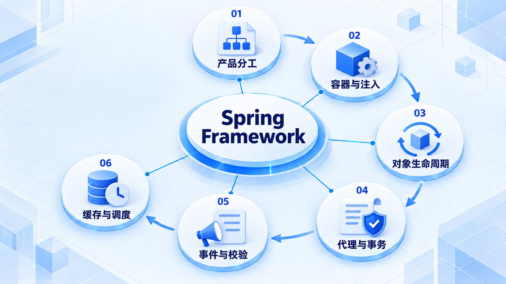
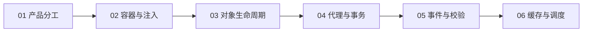

# Spring Framework

先弄清 Spring 各产品的分工，再认识容器如何管理对象；接着学习代理、事务和常用基础设施能力。

## 学习路线

箭头表示本章概念的推荐学习顺序，不表示实际系统只允许单向运行。框架与方案对照中的选项可以按项目需要选择。

## 本章核心模块

1. **产品分工**
2. **容器与注入**
3. **对象生命周期**
4. **代理与事务**
5. **事件与校验**
6. **缓存与调度**

## 按课程顺序阅读

1. [Spring Framework：从零开始的阶段导学](<../../content/Java开发/05-Spring Framework/00-本阶段导学.md>) · 文章
2. [Spring Framework、Boot、MVC、Data 与 Cloud 的责任边界](<../../content/Java开发/05-Spring Framework/05-Spring产品族责任边界.md>) · 文章
3. [Spring IoC、依赖注入与 Bean 生命周期](<../../content/Java开发/05-Spring Framework/01-IoC依赖注入与Bean生命周期.md>) · 文章
4. [Spring AOP、代理与声明式事务](<../../content/Java开发/05-Spring Framework/02-Spring-AOP代理与事务.md>) · 文章
5. [Spring 资源、事件、校验、缓存与任务调度](<../../content/Java开发/05-Spring Framework/03-Spring资源事件校验缓存与调度.md>) · 文章
6. [Spring 异步、任务调度、Quartz 与 Spring Batch](<../../content/Java开发/05-Spring Framework/04-Spring异步定时任务Quartz与Batch.md>) · 文章
7. [Spring Framework推荐阅读](<../../content/Java开发/05-Spring Framework/000-Spring Framework推荐阅读.md>) · 文章

[返回全部章节](README.md)
