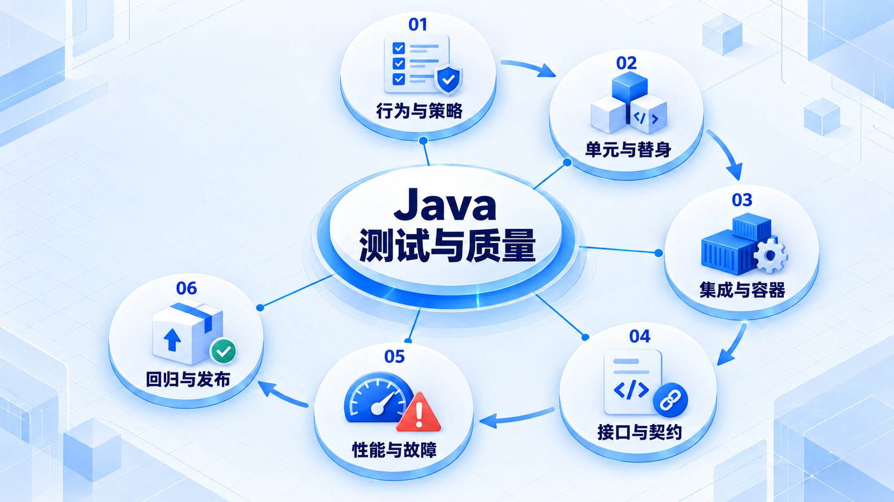

# Java 测试与质量

先明确要保护的行为，再安排单元、集成和契约检查；通过真实依赖与故障演练形成发布证据。

## 学习路线

箭头表示本章概念的推荐学习顺序，不表示实际系统只允许单向运行。框架与方案对照中的选项可以按项目需要选择。

## 本章核心模块

1. **行为与策略**
2. **单元与替身**
3. **集成与容器**
4. **接口与契约**
5. **性能与故障**
6. **回归与发布**

## 按课程顺序阅读

1. [测试与质量工程：从零开始的阶段导学](<../../content/Java开发/08-测试与质量工程/00-本阶段导学.md>) · 文章
2. [测试策略、JUnit 5 与 Mockito](<../../content/Java开发/08-测试与质量工程/01-测试策略-JUnit与Mockito.md>) · 文章
3. [Spring 集成测试、Testcontainers 与契约测试](<../../content/Java开发/08-测试与质量工程/02-Spring集成-Testcontainers与契约测试.md>) · 文章
4. [API、UI 自动化与持续质量平台](<../../content/Java开发/08-测试与质量工程/03-API-UI自动化与测试平台.md>) · 文章
5. [性能、稳定性测试与故障演练](<../../content/Java开发/08-测试与质量工程/04-性能稳定性与故障演练.md>) · 文章
6. [Testing Portfolio：行为边界、回归与发布证据](<../../content/Java开发/08-测试与质量工程/05-Testing Portfolio与发布回归.md>) · 文章
7. [测试与质量工程推荐阅读](<../../content/Java开发/08-测试与质量工程/000-测试与质量工程推荐阅读.md>) · 文章

[返回全部章节](README.md)
