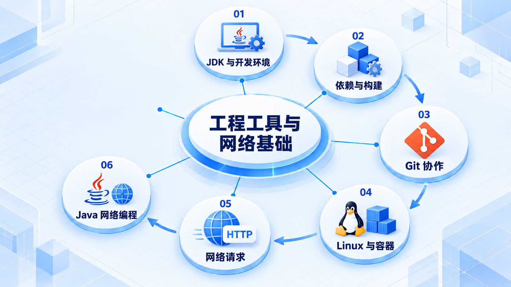

# 工程工具与网络基础

先建立可复现的开发与构建环境，再学习协作和服务运行；用一次网络请求把 Linux、网络和 Java 程序连起来。

## 学习路线

箭头表示本章概念的推荐学习顺序，不表示实际系统只允许单向运行。框架与方案对照中的选项可以按项目需要选择。

## 本章核心模块

1. **JDK 与开发环境**
2. **依赖与构建**
3. **Git 协作**
4. **Linux 与容器**
5. **网络请求**
6. **Java 网络编程**

## 按课程顺序阅读

1. [工程工具与 Linux：从零开始的阶段导学](<../../content/Java开发/03-工程基础与Internet-Linux/00-本阶段导学.md>) · 文章
2. [JDK、IDE、Maven 与 Gradle：可复现 Java 构建](<../../content/Java开发/03-工程基础与Internet-Linux/01-JDK-IDE-Maven与Gradle.md>) · 文章
3. [Git 协作与版本治理：提交、分支、合并、变基、标签与发布](<../../content/Java开发/03-工程基础与Internet-Linux/02-Git协作与版本治理.md>) · 文章
4. [Linux、Shell 与 Docker：运行 Java 服务的基础环境](<../../content/Java开发/03-工程基础与Internet-Linux/03-Linux-Shell与Docker.md>) · 文章
5. [Internet 心智模型：从 URL 到 Spring Controller](<../../content/Java开发/03-工程基础与Internet-Linux/04-Internet请求完整链路.md>) · 文章
6. [Java 网络编程：TCP、UDP、IP、端口、Socket、URL 与 HTTP Client](<../../content/Java开发/03-工程基础与Internet-Linux/05-Java网络编程.md>) · 文章
7. [Java 工程工具与 Linux推荐阅读](<../../content/Java开发/03-工程基础与Internet-Linux/000-Java 工程工具与 Linux推荐阅读.md>) · 文章

[返回全部章节](README.md)
