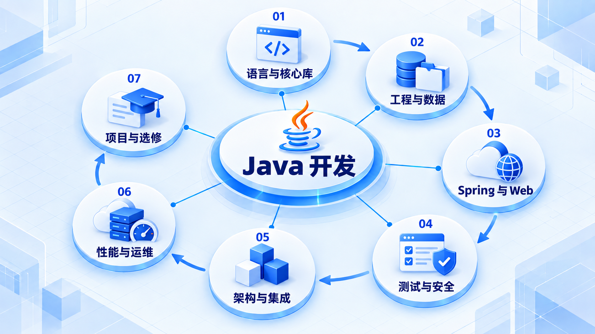

# Java 开发

先用 Java 写出并运行小程序，再建立工程、数据与 Web 服务能力；有了可维护的服务后，再深入并发、性能和分布式。

## 学习路线

箭头表示本章概念的推荐学习顺序，不表示实际系统只允许单向运行。框架与方案对照中的选项可以按项目需要选择。

## 本章核心模块

1. **语言与核心库**
2. **工程与数据**
3. **Spring 与 Web**
4. **测试与安全**
5. **架构与集成**
6. **性能与运维**
7. **项目与选修**

## 按课程顺序阅读

1. [Java 后端工程学习路线（2026）](<../../content/Java开发/00-Java后端学习路线.md>) · 文章
2. [Java 语言与核心 API](<java-core.md>) · 章节
3. [Java Backend Version Baseline 与 Compatibility Matrix](<../../content/Java开发/01-Version Baseline与Compatibility Matrix.md>) · 文章
4. [工程工具与网络基础](<java-tools.md>) · 章节
5. [关系型数据库](<java-database.md>) · 章节
6. [Spring Framework](<java-spring.md>) · 章节
7. [Spring Boot 与 Web](<java-boot.md>) · 章节
8. [数据访问与事务](<java-data-access.md>) · 章节
9. [Java 测试与质量](<java-testing.md>) · 章节
10. [Java 安全与权限](<java-security.md>) · 章节
11. [应用架构与模块化单体](<java-modularity.md>) · 章节
12. [缓存与搜索](<java-cache.md>) · 章节
13. [消息与事件驱动](<java-messaging.md>) · 章节
14. [分布式与微服务](<java-distributed.md>) · 章节
15. [JVM 与并发](<java-jvm.md>) · 章节
16. [Java 性能工程](<java-performance.md>) · 章节
17. [云原生与可观测性](<java-cloud.md>) · 章节
18. [Java 项目阶梯](<java-projects.md>) · 章节
19. [Java 可选专项](<java-electives.md>) · 章节
20. [Java 开源架构研究](<java-source.md>) · 章节

[返回全部章节](README.md)
