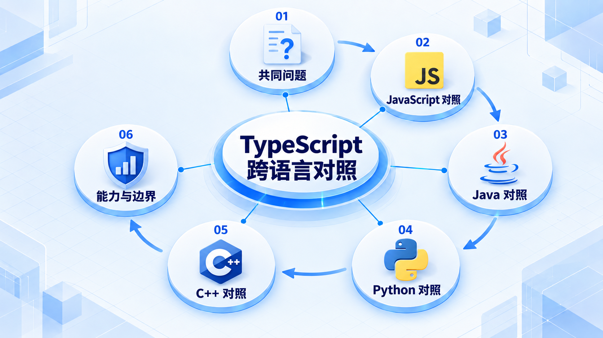

# TypeScript 跨语言对照

先区分编译、类型检查与执行，再比较语言之间相似语法背后的不同约束；不把一种语言的规则直接套到另一种语言上。

## 学习路线

箭头表示本章概念的推荐学习顺序，不表示实际系统只允许单向运行。框架与方案对照中的选项可以按项目需要选择。

## 本章核心模块

1. **共同问题**
2. **JavaScript 对照**
3. **Java 对照**
4. **Python 对照**
5. **C++ 对照**
6. **能力与边界**

## 按课程顺序阅读

1. [TypeScript、JavaScript、Java、Python、C++ 总览矩阵](<../../content/语言基础/02-TypeScript跨语言对照/00-五语言总览矩阵.md>) · 文章
2. [TypeScript 与 JavaScript：增加了什么、没有改变什么](<../../content/语言基础/02-TypeScript跨语言对照/01-TypeScript与JavaScript.md>) · 文章
3. [TypeScript 与 Java：结构类型、JVM 与泛型擦除的差异](<../../content/语言基础/02-TypeScript跨语言对照/02-TypeScript与Java.md>) · 文章
4. [TypeScript 与 Python：渐进类型、运行时注解与异步模型](<../../content/语言基础/02-TypeScript跨语言对照/03-TypeScript与Python.md>) · 文章
5. [TypeScript 与 C++：类型擦除、模板实例化、内存和对象模型](<../../content/语言基础/02-TypeScript跨语言对照/04-TypeScript与Cpp.md>) · 文章
6. [TypeScript 独有能力与缺失能力清单](<../../content/语言基础/02-TypeScript跨语言对照/05-TypeScript独有能力与缺失能力清单.md>) · 文章

[返回全部章节](README.md)
