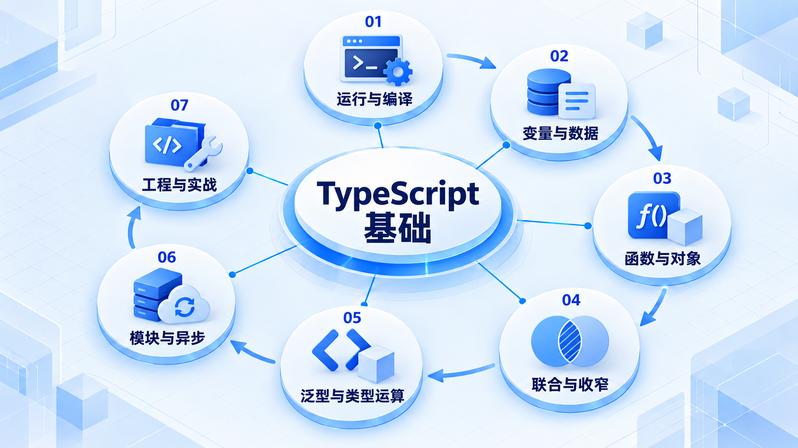

# TypeScript 基础

先运行一段程序，再理解数据与函数；掌握日常类型表达后，再进入泛型、类型运算和工程实践。

## 学习路线

箭头表示本章概念的推荐学习顺序，不表示实际系统只允许单向运行。框架与方案对照中的选项可以按项目需要选择。

## 本章核心模块

1. **运行与编译**
2. **变量与数据**
3. **函数与对象**
4. **联合与收窄**
5. **泛型与类型运算**
6. **模块与异步**
7. **工程与实战**

## 按课程顺序阅读

1. [环境配置与第一个 TypeScript 项目](<../../content/语言基础/01-TypeScript语言基础/01-环境配置与第一个TypeScript项目.md>) · 文章
2. [TypeScript 运行模型、类型擦除与编译产物](<../../content/语言基础/01-TypeScript语言基础/02-运行模型与编译产物.md>) · 文章
3. [变量、原始类型、字面量类型与类型推断](<../../content/语言基础/01-TypeScript语言基础/03-变量原始类型与类型推断.md>) · 文章
4. [数组、元组、对象、索引签名与只读边界](<../../content/语言基础/01-TypeScript语言基础/04-数组元组对象与只读.md>) · 文章
5. [函数签名、重载、this、回调与可调用对象](<../../content/语言基础/01-TypeScript语言基础/05-函数签名重载this与回调.md>) · 文章
6. [interface、type 与结构化类型系统](<../../content/语言基础/01-TypeScript语言基础/06-interface-type与结构化类型.md>) · 文章
7. [联合、交叉、控制流收窄与穷尽检查](<../../content/语言基础/01-TypeScript语言基础/07-联合交叉收窄与穷尽检查.md>) · 文章
8. [泛型、约束、推断、默认参数与变型](<../../content/语言基础/01-TypeScript语言基础/08-泛型约束推断与变型.md>) · 文章
9. [类、继承、抽象、访问控制与组合](<../../content/语言基础/01-TypeScript语言基础/09-类继承抽象与访问控制.md>) · 文章
10. [模块、包、模块解析与声明文件](<../../content/语言基础/01-TypeScript语言基础/10-模块包与声明文件.md>) · 文章
11. [keyof、typeof、索引访问与标准工具类型](<../../content/语言基础/01-TypeScript语言基础/11-keyof-typeof索引访问与工具类型.md>) · 文章
12. [映射类型、条件类型、模板字面量类型与 infer](<../../content/语言基础/01-TypeScript语言基础/12-映射条件模板字面量与infer.md>) · 文章
13. [tsconfig、严格模式、项目引用与工程编译](<../../content/语言基础/01-TypeScript语言基础/13-tsconfig严格模式与工程编译.md>) · 文章
14. [异步、错误边界、DOM 与 Node.js 类型](<../../content/语言基础/01-TypeScript语言基础/14-异步错误边界DOM与Node.md>) · 文章
15. [装饰器、JSX、枚举、namespace 与特殊语法边界](<../../content/语言基础/01-TypeScript语言基础/15-装饰器JSX与特殊语法边界.md>) · 文章
16. [测试、构建、Lint、发布与 JavaScript 迁移](<../../content/语言基础/01-TypeScript语言基础/16-测试构建Lint发布与迁移.md>) · 文章
17. [TypeScript 综合项目：可靠的配置加载器与类型安全客户端](<../../content/语言基础/01-TypeScript语言基础/17-综合项目与检查清单.md>) · 文章
18. [TypeScript 官方资料、学习顺序与版本边界](<../../content/语言基础/01-TypeScript语言基础/000-TypeScript官方资料与版本边界.md>) · 文章

[返回全部章节](README.md)
