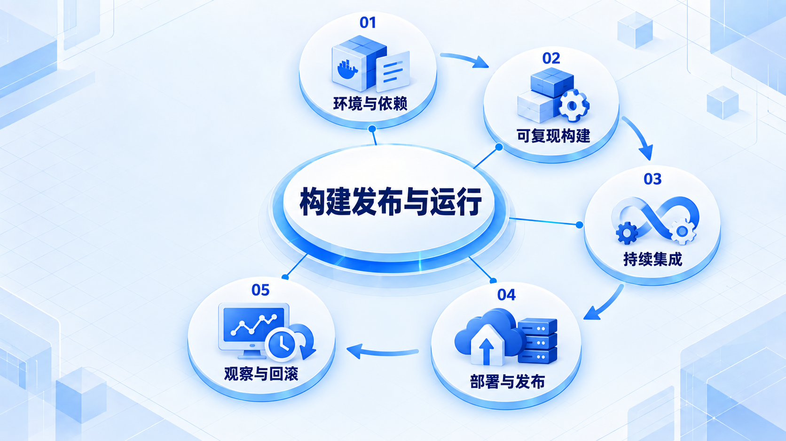

# 构建发布与运行

让代码在一致的环境里构建和检查，再区分部署与发布；上线后观察真实行为，并准备恢复办法。

## 学习路线

箭头表示本章概念的推荐学习顺序，不表示实际系统只允许单向运行。框架与方案对照中的选项可以按项目需要选择。

## 本章核心模块

1. **环境与依赖**
2. **可复现构建**
3. **持续集成**
4. **部署与发布**
5. **观察与回滚**

## 按课程顺序阅读

1. [构建环境与持续集成：为什么你电脑上能跑还不够](<../../content/软件工程/06-构建发布与运行/01-构建环境与持续集成.md>) · 文章
2. [部署、发布、回滚与观察：把功能交到用户手里](<../../content/软件工程/06-构建发布与运行/02-部署发布回滚与观察.md>) · 文章

[返回全部章节](README.md)
