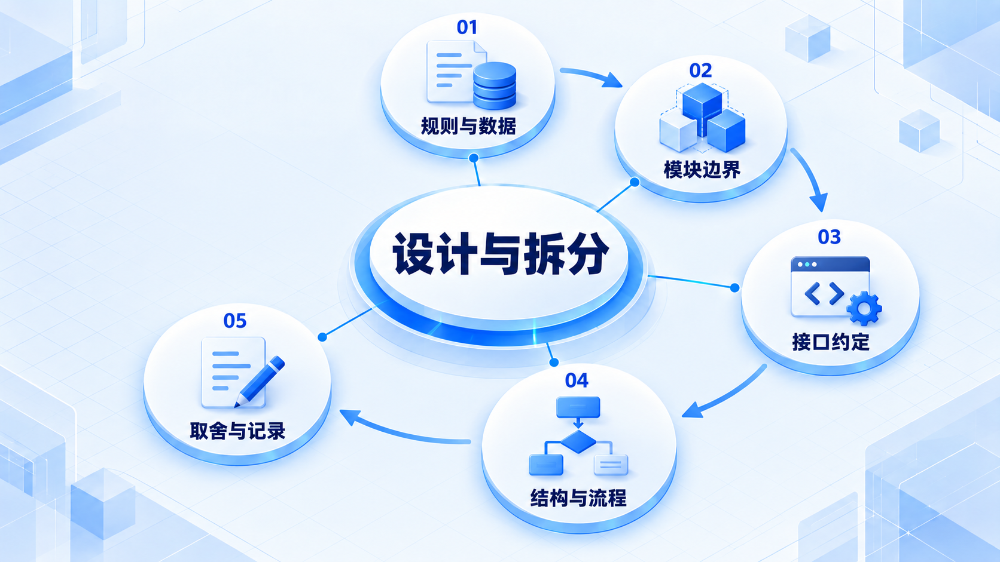
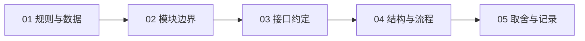

# 设计与拆分

先找业务规则和数据的归属，再约定模块怎样协作；用一张图和一条决策记录说明取舍。

## 学习路线

箭头表示本章概念的推荐学习顺序，不表示实际系统只允许单向运行。框架与方案对照中的选项可以按项目需要选择。

## 本章核心模块

1. **规则与数据**
2. **模块边界**
3. **接口约定**
4. **结构与流程**
5. **取舍与记录**

## 按课程顺序阅读

1. [模块边界与接口约定：让改动有一个落脚点](<../../content/软件工程/03-设计与拆分/01-模块边界与接口约定.md>) · 文章
2. [设计图、取舍与决策记录：让别人知道你为什么这样做](<../../content/软件工程/03-设计与拆分/02-设计图取舍与决策记录.md>) · 文章

[返回全部章节](README.md)
