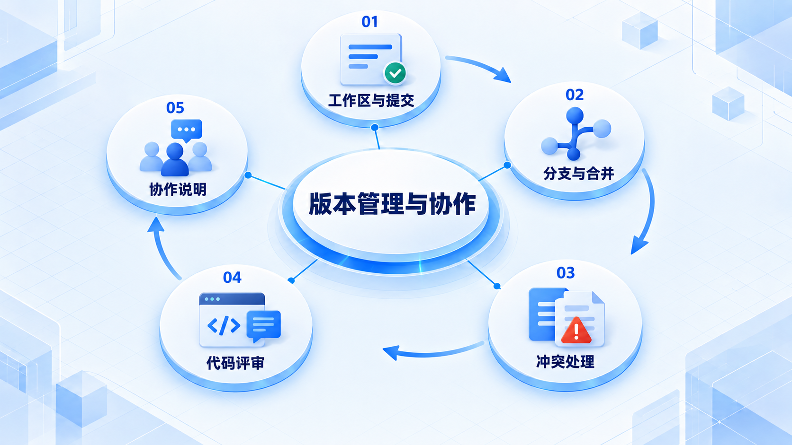
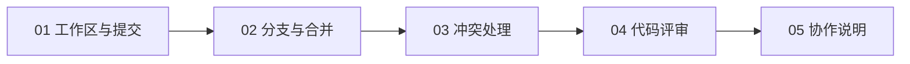

# 版本管理与协作

先用提交记录一次清楚的修改，再练习分支、合并和评审，让协作者能理解变化并验证结果。

## 学习路线

箭头表示本章概念的推荐学习顺序，不表示实际系统只允许单向运行。框架与方案对照中的选项可以按项目需要选择。

## 本章核心模块

1. **工作区与提交**
2. **分支与合并**
3. **冲突处理**
4. **代码评审**
5. **协作说明**

## 按课程顺序阅读

1. [Git 从保存改动到合并：给每一次变化留下记录](<../../content/软件工程/04-版本管理与协作/01-Git从保存改动到合并.md>) · 文章
2. [代码评审与团队沟通：让别人看懂这次改动](<../../content/软件工程/04-版本管理与协作/02-代码评审与团队沟通.md>) · 文章

[返回全部章节](README.md)
