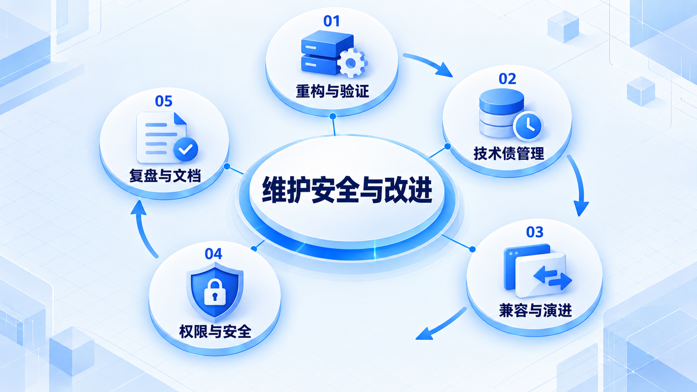
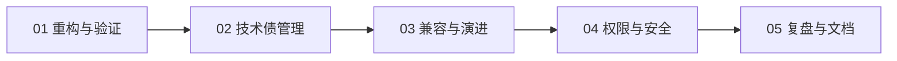

# 维护安全与改进

在保留行为的前提下改进结构，同时管理技术债和兼容性；把安全检查与故障复盘落实为可执行的改进。

## 学习路线

箭头表示本章概念的推荐学习顺序，不表示实际系统只允许单向运行。框架与方案对照中的选项可以按项目需要选择。

## 本章核心模块

1. **重构与验证**
2. **技术债管理**
3. **兼容与演进**
4. **权限与安全**
5. **复盘与文档**

## 按课程顺序阅读

1. [重构、技术债与兼容性：功能能用以后怎样继续改](<../../content/软件工程/07-维护安全与改进/01-重构技术债与兼容性.md>) · 文章
2. [安全意识、故障复盘与文档：让系统经得起真实使用](<../../content/软件工程/07-维护安全与改进/02-安全意识故障复盘与文档.md>) · 文章

[返回全部章节](README.md)
