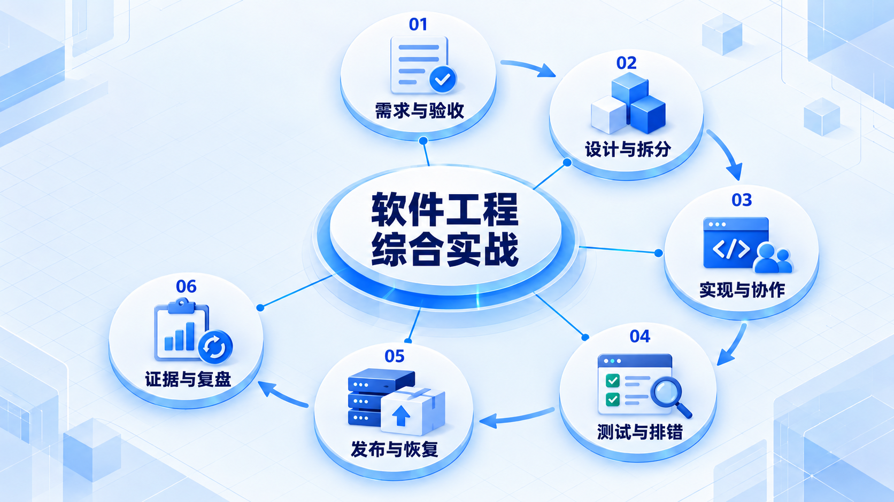
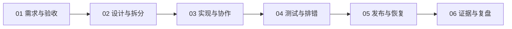

# 软件工程综合实战

用收藏功能串起完整过程：需求、设计、实现与验证必须相互对应，最终交付可运行、可检查的成果。

## 学习路线

箭头表示本章概念的推荐学习顺序，不表示实际系统只允许单向运行。框架与方案对照中的选项可以按项目需要选择。

## 本章核心模块

1. **需求与验收**
2. **设计与拆分**
3. **实现与协作**
4. **测试与排错**
5. **发布与恢复**
6. **证据与复盘**

## 按课程顺序阅读

1. [收藏功能从需求到交付：把前面的小步骤连起来](<../../content/软件工程/08-把全过程做一遍/01-收藏功能从需求到交付.md>) · 文章
2. [工程取舍与学习自检：遇到新项目先问什么](<../../content/软件工程/08-把全过程做一遍/02-工程取舍与学习自检.md>) · 文章

[返回全部章节](README.md)
