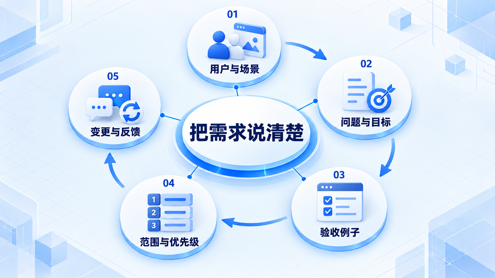
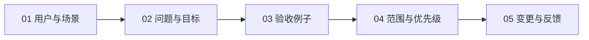

# 把需求说清楚

把“好用一点”变成具体场景和验收例子，再决定本轮做什么、暂时不做什么，以及变化来了如何处理。

## 学习路线

箭头表示本章概念的推荐学习顺序，不表示实际系统只允许单向运行。框架与方案对照中的选项可以按项目需要选择。

## 本章核心模块

1. **用户与场景**
2. **问题与目标**
3. **验收例子**
4. **范围与优先级**
5. **变更与反馈**

## 按课程顺序阅读

1. [从用户问题到验收标准：把“好用一点”写具体](<../../content/软件工程/02-把需求说清楚/01-从用户问题到验收标准.md>) · 文章
2. [范围、优先级与需求变更：新想法来了怎么办](<../../content/软件工程/02-把需求说清楚/02-范围优先级与需求变更.md>) · 文章

[返回全部章节](README.md)
